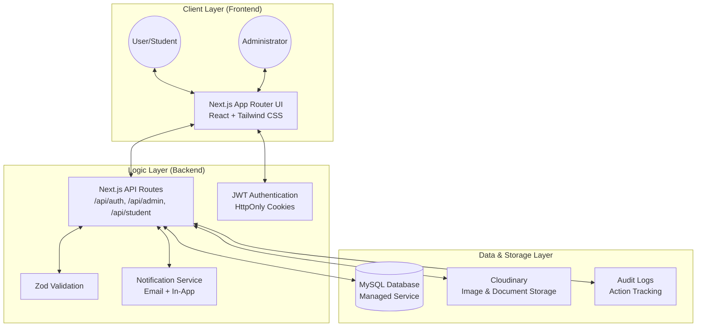

# StayUniKL — Project Architecture
**System Architecture & Technical Stack | FYP Documentation**

---

## 1. High-Level System Architecture

StayUniKL is built as a unified full-stack application using the **Next.js App Router** architecture. This ensures a seamless integration between the frontend user interface and backend API logic.

---

## 2. Technical Stack

| Component | Technology | Description |
|---|---|---|
| **Framework** | **Next.js (App Router)** | Used for Server-Side Rendering (SSR) and Client-Side Navigation. |
| **Frontend UI** | **React + Tailwind CSS** | Premium, responsive design system with a focus on dark-mode aesthetics. |
| **Language** | **TypeScript** | Ensures type safety across the entire application. |
| **Database** | **MySQL** | Relational database used for complex relationships (Tenants → Rooms → Bookings). |
| **Authentication** | **JWT (Jose/Bcrypt)** | Stateless authentication with secure HttpOnly cookies. |
| **Image Hosting** | **Cloudinary** | Handles optimization and storage for student IDs and profile images. |
| **Email Service** | **Nodemailer** | Triggers automated emails for application approvals and booking reminders. |
| **Form Handling** | **Zod + React Hook Form** | Strict schema validation for both client and server-side data. |

---

## 3. Data Flow Overview

### A. Authentication Flow
1. User submits credentials to `/api/auth/login`.
2. Server validates password using `bcrypt`.
3. If valid, a **JWT token** is generated and stored in a secure **HttpOnly cookie**.
4. `Middleware.ts` intercepts subsequent requests to verify the token and role permissions.

### B. Hostel Application Flow
1. Student uploads documents; documents are streamed directly to **Cloudinary**.
2. Application data and Cloudinary URLs are saved to the **MySQL Database**.
3. Admin is notified via the internal notification system and email.

### C. Check-In Security
1. System generates a unique check-in signature for assigned students.
2. Signature is converted into a **QR Code** on the student dashboard.
3. Admin scans the QR code; server verifies the payload against the database to confirm identity and room assignment.

---

## 4. Security Implementation

*   **Rate Limiting**: Brute-force protection on login routes (5 attempts before 15-minute lockout).
*   **Role-Based Access Control (RBAC)**: Strict separation between `Student`, `Admin`, and `Superadmin` routes.
*   **Input Sanitization**: All database queries use prepared statements via `mysql2` to prevent SQL Injection.
*   **Environment Protection**: Sensitive keys (DB, Cloudinary, JWT) are managed via encrypted `.env` variables.

---
*Generated for StayUniKL FYP | System Architect View*
