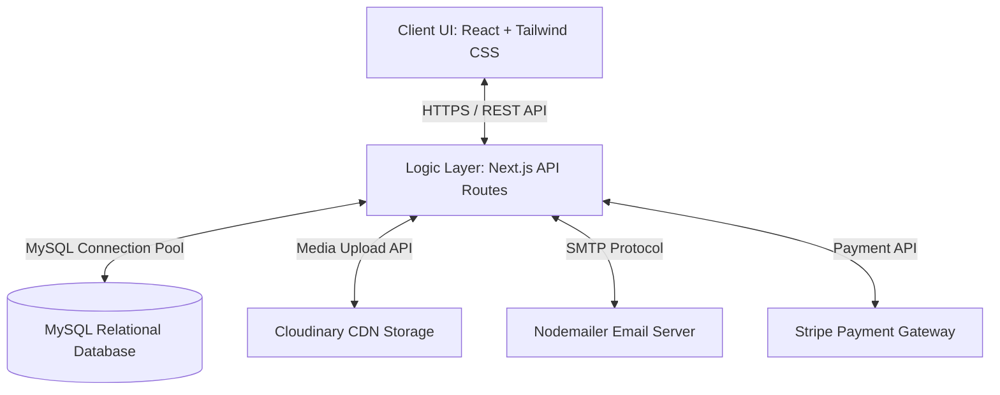
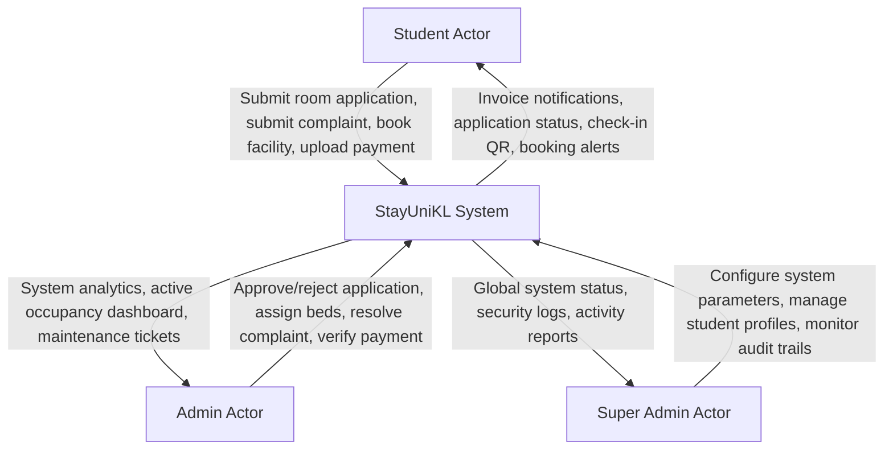
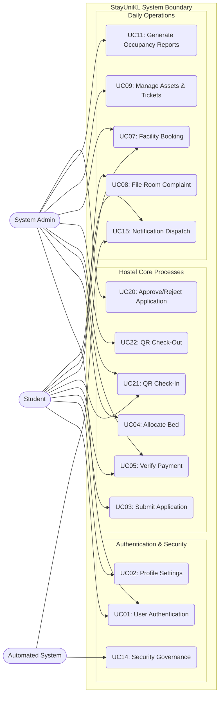
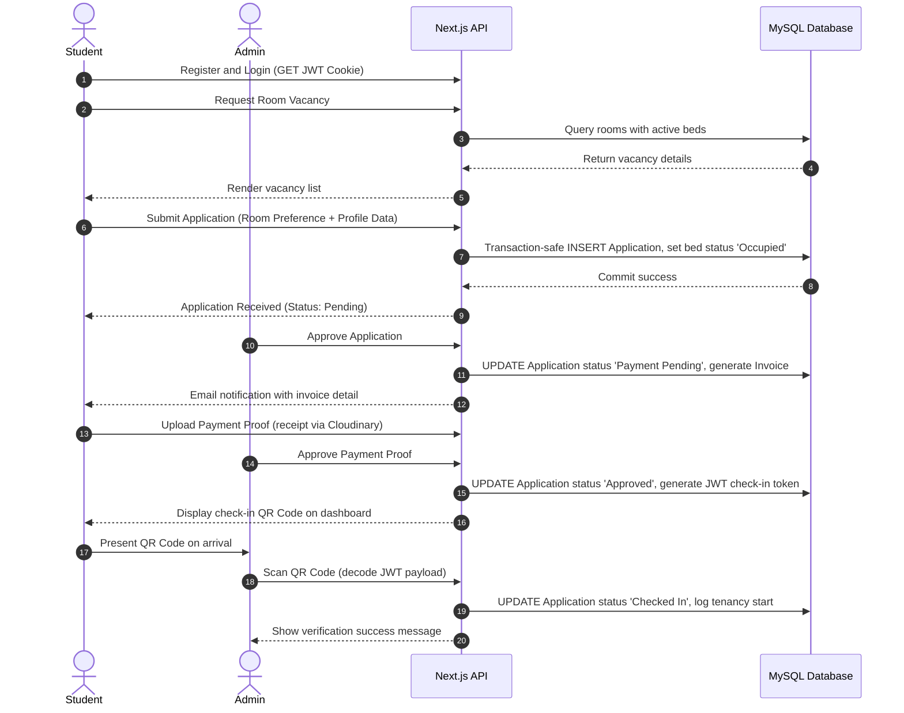

# CHAPTER 3: METHODOLOGY

## 3.1 Development Methodology
To develop **StayUniKL: Student Accommodation Management System**, the **Rapid Application Development (RAD)** methodology was chosen as the Software Development Life Cycle (SDLC) framework. RAD is an adaptive, iterative software development model that prioritizes rapid prototyping and active user feedback over rigid, sequential planning (Martin, 1991). This methodology is highly suited for StayUniKL because the system relies on interactive component interfaces (e.g., the dynamic Room Matrix and facility scheduling calendars) that benefit from fast visual prototyping and continuous user evaluation.


*Figure 3.1: Rapid Application Development (RAD) Lifecycle*

The RAD framework is structured into four primary phases, which were implemented in StayUniKL as follows:
1. **Requirements Planning:** Students, university accommodation staff, and the researcher collaboratively discussed operational bottlenecks (manual forms, booking overlaps) and agreed on the system scope and core requirements.
2. **User Design:** Visual mockups and initial frontend components were constructed using Next.js, React, and Tailwind CSS. The prototype dashboards were demonstrated to students and staff to gather feedback on layout usability.
3. **Construction:** Backend REST APIs, MySQL connection pools, security tokens, and external API gateways (Stripe, Cloudinary) were built and integrated directly with the refined frontend components.
4. **Cutover:** The final integration testing was performed, database tables were populated with asset records, and the completed application was deployed to cloud hosting.

---

## 3.2 Requirement Gathering
Requirement gathering is a critical phase to ensure StayUniKL meets the operational needs of UniKL MIIT hostel administration. Several techniques were employed:

### 3.2.1 Document Analysis (Google Forms & Spreadsheets)
The researcher analyzed the Google Forms and spreadsheets currently used by UniKL MIIT staff to register students and manage room vacancies. This analysis revealed key data points needed for the system: student ID, intake details, block number, floor number, room number, bed ID, gender, contact number, and payment verification status.

### 3.2.2 User Interviews
Semi-structured interviews were conducted with two UniKL MIIT hostel administrators and three active hostel students. 
* **Administrators** highlighted the need for automatic room allocation constraints (preventing gender mismatches) and conflict-free facility bookings.
* **Students** emphasized the need for a mobile-friendly dashboard to track applications, upload payment proofs, and quickly access check-in QR codes.

### 3.2.3 Requirements Classification
The gathered data was classified into Functional and Non-Functional requirements:
* **Functional Requirements:**
  * System must authenticate users and enforce roles (Student, Admin, Super Admin).
  * Students must be able to select vacant rooms and submit applications.
  * System must prevent double-booking of beds and facility slots.
  * System must generate dynamic, secure check-in QR codes containing encrypted student IDs.
  * System must automatically flag booking "No-Shows" and ban students.
* **Non-Functional Requirements:**
  * **Security:** Cryptographic password hashing using bcrypt, session tokens via JWT, and data transmission over HTTPS.
  * **Performance:** Relational database queries must resolve in less than 500 milliseconds.
  * **Usability:** System interface must be fully responsive, adapting seamlessly to mobile, tablet, and desktop screens.

---

## 3.3 System Analysis
System Analysis translates user requirements into technical specifications. In StayUniKL, this was achieved using object-oriented analysis and modeling:

1. **Use Case Modeling:** A system boundary was established, defining how external actors (Student, Admin, System) interact with the core StayUniKL system. Each use case was documented with preconditions, main flows, and alternate flows to establish unambiguous logic for programmers.
2. **Data Flow Analysis:** User flows were mapped out, tracing data movement from client forms (e.g., submitting an application or booking a badminton court) through server-side validators (Zod schemas) to the database level.
3. **Concurrency Analysis:** Relational integrity checks were mapped to ensure that database rows (such as specific beds or booking slots) are locked transactionally during high-concurrency operations, neutralizing race conditions.

---

## 3.4 Development Tools and Technologies
The development stack for StayUniKL was carefully selected to ensure modern performance, security, and developer productivity:

* **Programming Language:** **TypeScript** is used across both frontend and backend code to provide static type safety, reducing runtime errors and improving codebase maintainability.
* **Frontend Library:** **React** (version 19) is used for component-based user interface design, utilizing a stateful virtual DOM to render real-time UI updates.
* **Full-Stack Framework:** **Next.js** (version 15, App Router) manages server-side rendering (SSR), client-side routing, and API endpoints (Serverless API Routes).
* **Styling Engine:** **Tailwind CSS** (version 4) is utilized for modern, responsive UI design, ensuring the app looks premium and adjusts to any screen size.
* **Database Management System:** **MySQL** handles data storage. MySQL is a highly stable, ACID-compliant relational database, which is critical for enforcing foreign key relationships between Tenants, Rooms, and Bookings.
* **Cloud Storage:** **Cloudinary** is integrated to store and optimize static image files (such as student profile photos and payment receipts) through direct streaming APIs.
* **Payment Gateway:** **Stripe API** is implemented to process digital transactions securely and simulate mock credit card payments for hostel invoices.
* **Email Broker:** **Nodemailer** manages transactional email dispatches, notifying students of booking approvals, invoice releases, and cron-triggered booking bans.

---

## 3.5 Development Phases
Aligned with the RAD methodology, the development of StayUniKL was structured into four core phases:

### Phase 1: Requirements Planning
The researcher conducted feasibility evaluations and initial interviews with UniKL staff and students. Operational constraints and data fields were established, defining the system's goals and boundaries.

### Phase 2: User Design (Prototyping)
During this interactive phase, visual prototypes of the user dashboards, dynamic room matrix layout, and facility calendars were created using Next.js and Tailwind CSS. The prototypes were shared with users to check navigation and usability, iterating layout designs based on user suggestions.

### Phase 3: Construction (Development and Integration)
The application architecture was built, connecting the database engines, API endpoints, Zod schema validations, and JWT session controls. The functional modules (booking engines, payment verification, maintenance forms, and cron routines) were coded, and functional and integration tests were conducted.

### Phase 4: Cutover (Testing, Training, and Deployment)
The system was subjected to final User Acceptance Testing (UAT) with 30 students and 5 administrators to analyze usability score rankings. After obtaining approval, the database was populated with assets (`assets_population.sql`), and the application was deployed to cloud services.

---

## 3.6 System Architecture
The system architecture of **StayUniKL** follows a modern, multi-tier full-stack layout designed to decouple user interactions from backend database operations and third-party API integrations. The architecture is composed of three primary layers:
1. **Client Layer (Frontend Presentation):** Built with React 19 and styled with Tailwind CSS, this layer renders the responsive user interface. It communicates asynchronously with the logic layer using standard HTTP clients (fetch) and manages local state updates in client-side React components.
2. **Logic Layer (API and Middleware):** Built using Next.js App Router API endpoints written in TypeScript. This layer handles user request validation (via Zod), role authorization middleware, cryptographic routines (bcrypt/jose), email notifications (Nodemailer), and third-party integrations (Stripe, Cloudinary).
3. **Data Layer (Storage and Persistence):** Composed of a relational MySQL database server. Static assets, profile pictures, and payment receipts are stored on Cloudinary's cloud infrastructure, with only their corresponding URLs saved in MySQL.


*Figure 3.2: StayUniKL System Architecture*

---

## 3.7 System Design Diagrams

### 3.7.1 Context Diagram
The Context Diagram represents the high-level boundary of the StayUniKL system, showing how external entities exchange data with the core system.


*Figure 3.3: Context Diagram of StayUniKL*

### 3.7.2 Use Case Diagram
The behavioral requirements of the StayUniKL system are modeled in the following Use Case Diagram, separating user-facing modules from administrative management tasks.


*Figure 3.4: StayUniKL Use Case Diagram*

### 3.7.3 User Flow Diagram
To clarify the integration of different operations, Figure 3.5 traces a student's lifecycle from initial registration to room check-in:


*Figure 3.5: End-to-End Room Allocation & Check-In Sequence*

---

## 3.8 Database Design

### 3.8.1 Entity-Relationship Diagram (ERD)
The database structure is designed to support high transactional consistency and relational integrity.

```mermaid
erDiagram
    USERS {
        VARCHAR id PK
        VARCHAR name
        VARCHAR email UNIQUE
        VARCHAR password
        ENUM role
        ENUM gender
        VARCHAR student_id
        VARCHAR phone
        TIMESTAMP created_at
    }
    ROOMS {
        VARCHAR id PK
        VARCHAR room_number
        VARCHAR block
        VARCHAR floor
        ENUM gender
        ENUM room_type
    }
    BEDS {
        VARCHAR id PK
        VARCHAR room_id FK
        VARCHAR bed_number
        ENUM status
    }
    APPLICATIONS {
        VARCHAR id PK
        VARCHAR user_id FK
        VARCHAR room_id FK
        VARCHAR bed_id FK
        ENUM status
        ENUM payment_status
        ENUM payment_method
        VARCHAR intake
        TIMESTAMP created_at
    }
    INVOICES {
        VARCHAR id PK
        VARCHAR user_id FK
        VARCHAR application_id FK
        DECIMAL amount
        ENUM status
        VARCHAR evidence_url
        TIMESTAMP created_at
    }
    BOOKINGS {
        VARCHAR id PK
        VARCHAR user_id FK
        VARCHAR facility_id FK
        DATE date
        TIME start_time
        TIME end_time
        ENUM status
        TIMESTAMP created_at
    }
    COMPLAINTS {
        VARCHAR id PK
        VARCHAR user_id FK
        VARCHAR room_id FK
        VARCHAR category
        TEXT description
        ENUM status
        VARCHAR file_url
        TIMESTAMP created_at
    }
    AUDIT_LOGS {
        VARCHAR id PK
        VARCHAR user_id FK
        VARCHAR action
        VARCHAR details
        TIMESTAMP created_at
    }

    USERS ||--o{ APPLICATIONS : submits
    USERS ||--o{ INVOICES : owns
    USERS ||--o{ BOOKINGS : reserves
    USERS ||--o{ COMPLAINTS : reports
    USERS ||--o{ AUDIT_LOGS : performs
    ROOMS ||--|{ BEDS : contains
    APPLICATIONS ||--|| BEDS : allocates
    APPLICATIONS ||--o| ROOMS : assigns
    COMPLAINTS }o--|| ROOMS : linked_to
    INVOICES }o--|| APPLICATIONS : references
```
*Figure 3.6: StayUniKL Entity-Relationship Diagram (ERD)*

### 3.8.2 Data Dictionary

#### Table 3.1: `users` Table
| Column Name | Data Type | Constraint | Description |
|---|---|---|---|
| `id` | VARCHAR(50) | Primary Key | Unique UUID generated on registration |
| `name` | VARCHAR(255) | NOT NULL | Full name of the user |
| `email` | VARCHAR(255) | UNIQUE, NOT NULL | University email address |
| `password` | VARCHAR(255) | NOT NULL | Bcrypt-hashed password string |
| `role` | ENUM('student', 'admin', 'superadmin') | NOT NULL | Access privileges assigned to the user |
| `gender` | ENUM('male', 'female') | NOT NULL | Gender for room assignment checks |
| `student_id` | VARCHAR(50) | NULL | Student registration number |
| `phone` | VARCHAR(50) | NULL | Contact phone number |

#### Table 3.2: `applications` Table
| Column Name | Data Type | Constraint | Description |
|---|---|---|---|
| `id` | VARCHAR(50) | Primary Key | Unique UUID of the application |
| `user_id` | VARCHAR(50) | Foreign Key (users.id) | Student submitting the application |
| `room_id` | VARCHAR(50) | Foreign Key (rooms.id) | Requested room identifier |
| `bed_id` | VARCHAR(50) | Foreign Key (beds.id) | Specific assigned bed |
| `status` | ENUM('Pending', 'Payment Pending', 'Approved', 'Rejected', 'Checked In', 'Checked Out', 'Cancelled') | Default: 'Pending' | Stage of application process |
| `payment_status` | ENUM('Unpaid', 'Pending Verification', 'Paid', 'Refunded') | Default: 'Unpaid' | Invoice payment tracking |
| `payment_method` | ENUM('Stripe', 'Manual Transfer', 'Installment') | Default: 'Manual Transfer' | Selected invoice payment channel |
| `intake` | VARCHAR(100) | NOT NULL | Enrollment intake cohort (e.g., 'May 2026') |

#### Table 3.3: `bookings` Table
| Column Name | Data Type | Constraint | Description |
|---|---|---|---|
| `id` | VARCHAR(50) | Primary Key | Unique reservation identifier |
| `user_id` | VARCHAR(50) | Foreign Key (users.id) | Resident booking the facility |
| `facility_id` | VARCHAR(100) | NOT NULL | Identifier of court, gym, or laundry machine |
| `date` | DATE | NOT NULL | Reserved booking calendar date |
| `start_time` | TIME | NOT NULL | Start of reservation (1-hour constraint) |
| `end_time` | TIME | NOT NULL | End of reservation |
| `status` | ENUM('Confirmed', 'Cancelled', 'No-Show', 'Completed') | Default: 'Confirmed' | Booking status |

---

## 3.9 UI and Security Design

### 3.9.1 UI Design
The UI design of StayUniKL employs a responsive grid system constructed with Tailwind CSS. Key design paradigms include:
* **Dashboard Split-Views:** Students view active rooms, facility calendars, and complaints on a single unified page, styled in a dashboard layout.
* **Dynamic Room Matrix:** Admins access a visual blueprint representation of rooms. Rooms are color-coded dynamically based on capacity status (Green = Vacant, Yellow = Partially Vacant, Red = Full, Grey = Under Maintenance).
* **Mobile-Responsive Calendar Grid:** The facility scheduler renders dynamic hours based on screen dimensions, adapting from full tables to single-column carousels on mobile screens.

### 3.9.2 Security Design
To prevent security leaks, StayUniKL implements a layered security defense model:
1. **JWT in HttpOnly Cookies:** Access tokens are signed using the `jose` library with an environment-stored secret (`JWT_SECRET`). Tokens are saved as cookies with `HttpOnly`, `Secure`, and `SameSite=Strict` flags. This prevents Client-side script reading (XSS mitigation) and cross-site request forgery (CSRF mitigation).
2. **Row-Level Transaction Safety:** Critical database modifications (e.g., locking a room allocation bed or reserving a booking slot) are enclosed in SQL transactions using raw pool queries. The engine uses `SELECT ... FOR UPDATE` locks to prevent race conditions during concurrent requests.
3. **Zod Validation Schemas:** Inputs to Next.js API handlers are validated using strict Zod schemas. Any payload with incorrect formats, sizes, or SQL Injection attempts is rejected immediately at the application boundary, returning a 400 Bad Request error.
4. **API Rate Limiting:** Auth routes (login/register) are wrapped with serverless ip-bound rate limit headers (5 requests per minute limit) to prevent dictionary and brute-force attacks on student passwords.

---

## References (Chapter 3)
* Kendall, K. E., & Kendall, J. E. (2013). *Systems Analysis and Design* (9th ed.). Pearson.
* Martin, J. (1991). *Rapid Application Development*. Macmillan Publishing Co.
* Silberschatz, A., Korth, H. F., & Sudarshan, S. (2019). *Database System Concepts* (7th ed.). McGraw-Hill.
