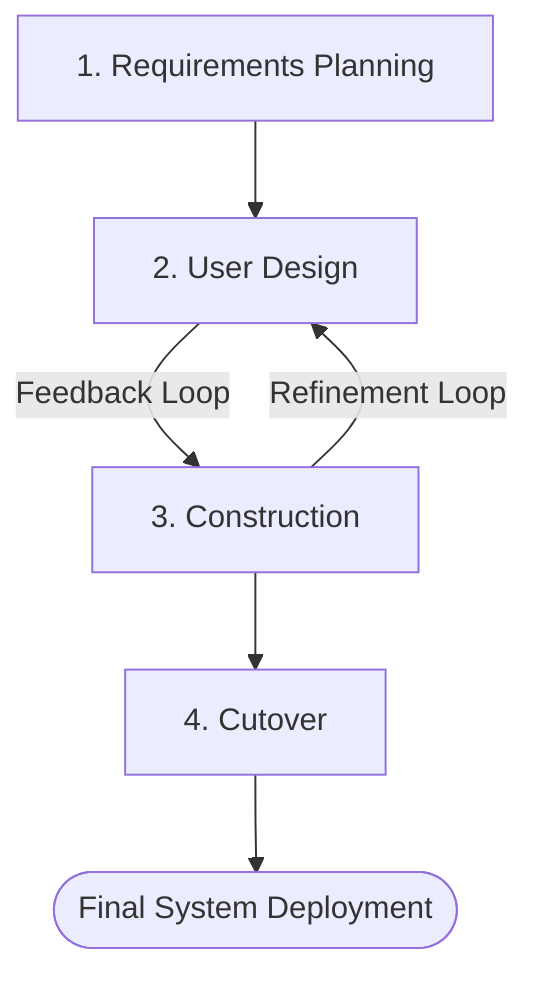

# CHAPTER 3: METHODOLOGY

## 3.1 Development Methodology
To develop **StayUniKL: Student Accommodation Management System**, the **Rapid Application Development (RAD)** methodology was chosen as the Software Development Life Cycle (SDLC) framework. RAD is an adaptive, iterative software development model that prioritizes rapid prototyping and active user feedback over rigid, sequential planning (Martin, 1991). This methodology is highly suited for StayUniKL because the system relies on interactive component interfaces (e.g., the dynamic Room Matrix and facility scheduling calendars) that benefit from fast visual prototyping and continuous user evaluation.

*Figure 3.1: Rapid Application Development (RAD) Lifecycle*

The RAD framework is structured into four primary phases, which were implemented in StayUniKL as follows:
1. **Requirements Planning:** Students, university accommodation staff, and the researcher collaboratively discussed operational bottlenecks (manual forms, booking overlaps) and agreed on the system scope and core requirements.
2. **User Design:** Visual mockups and initial frontend components were constructed using Next.js, React, and Tailwind CSS. The prototype dashboards were demonstrated to students and staff to gather feedback on layout usability.
3. **Construction:** Backend REST APIs, MySQL connection pools, security tokens, and external API gateways (Stripe, Cloudinary) were built and integrated directly with the refined frontend components.
4. **Cutover:** The final integration testing was performed, database tables were populated with asset records, and the completed application was deployed to cloud hosting.

---

## 3.2 Requirement Gathering
Requirement gathering is a critical phase to ensure StayUniKL meets the operational needs of UniKL MIIT hostel administration. Several techniques were employed:

### 3.2.1 Document Analysis (Google Forms & Spreadsheets)
The researcher analyzed the Google Forms and spreadsheets currently used by UniKL MIIT staff to register students and manage room vacancies. This analysis revealed key data points needed for the system: student ID, intake details, block number, floor number, room number, bed ID, gender, contact number, and payment verification status.

### 3.2.2 User Interviews
Semi-structured interviews were conducted with two UniKL MIIT hostel administrators and three active hostel students. 
* **Administrators** highlighted the need for automatic room allocation constraints (preventing gender mismatches) and conflict-free facility bookings.
* **Students** emphasized the need for a mobile-friendly dashboard to track applications, upload payment proofs, and quickly access check-in QR codes.

### 3.2.3 Requirements Classification
The gathered data was classified into Functional and Non-Functional requirements:
* **Functional Requirements:**
  * System must authenticate users and enforce roles (Student, Admin, Super Admin).
  * Students must be able to select vacant rooms and submit applications.
  * System must prevent double-booking of beds and facility slots.
  * System must generate dynamic, secure check-in QR codes containing encrypted student IDs.
  * System must automatically flag booking "No-Shows" and ban students.
* **Non-Functional Requirements:**
  * **Security:** Cryptographic password hashing using bcrypt, session tokens via JWT, and data transmission over HTTPS.
  * **Performance:** Relational database queries must resolve in less than 500 milliseconds.
  * **Usability:** System interface must be fully responsive, adapting seamlessly to mobile, tablet, and desktop screens.

---

## 3.3 System Analysis
System Analysis translates user requirements into technical specifications. In StayUniKL, this was achieved using object-oriented analysis and modeling:

1. **Use Case Modeling:** A system boundary was established, defining how external actors (Student, Admin, System) interact with the core StayUniKL system. Each use case was documented with preconditions, main flows, and alternate flows to establish unambiguous logic for programmers.
2. **Data Flow Analysis:** User flows were mapped out, tracing data movement from client forms (e.g., submitting an application or booking a badminton court) through server-side validators (Zod schemas) to the database level.
3. **Concurrency Analysis:** Relational integrity checks were mapped to ensure that database rows (such as specific beds or booking slots) are locked transactionally during high-concurrency operations, neutralizing race conditions.

---

## 3.4 Development Tools and Technologies
The development stack for StayUniKL was carefully selected to ensure modern performance, security, and developer productivity:

* **Programming Language:** **TypeScript** is used across both frontend and backend code to provide static type safety, reducing runtime errors and improving codebase maintainability.
* **Frontend Library:** **React** (version 19) is used for component-based user interface design, utilizing a stateful virtual DOM to render real-time UI updates.
* **Full-Stack Framework:** **Next.js** (version 15, App Router) manages server-side rendering (SSR), client-side routing, and API endpoints (Serverless API Routes).
* **Styling Engine:** **Tailwind CSS** (version 4) is utilized for modern, responsive UI design, ensuring the app looks premium and adjusts to any screen size.
* **Database Management System:** **MySQL** handles data storage. MySQL is a highly stable, ACID-compliant relational database, which is critical for enforcing foreign key relationships between Tenants, Rooms, and Bookings.
* **Cloud Storage:** **Cloudinary** is integrated to store and optimize static image files (such as student profile photos and payment receipts) through direct streaming APIs.
* **Payment Gateway:** **Stripe API** is implemented to process digital transactions securely and simulate mock credit card payments for hostel invoices.
* **Email Broker:** **Nodemailer** manages transactional email dispatches, notifying students of booking approvals, invoice releases, and cron-triggered booking bans.

---

## 3.5 Development Phases
Aligned with the RAD methodology, the development of StayUniKL was structured into four core phases:

### Phase 1: Requirements Planning
The researcher conducted feasibility evaluations and initial interviews with UniKL staff and students. Operational constraints and data fields were established, defining the system's goals and boundaries.

### Phase 2: User Design (Prototyping)
During this interactive phase, visual prototypes of the user dashboards, dynamic room matrix layout, and facility calendars were created using Next.js and Tailwind CSS. The prototypes were shared with users to check navigation and usability, iterating layout designs based on user suggestions.

### Phase 3: Construction (Development and Integration)
The application architecture was built, connecting the database engines, API endpoints, Zod schema validations, and JWT session controls. The functional modules (booking engines, payment verification, maintenance forms, and cron routines) were coded, and functional and integration tests were conducted.

### Phase 4: Cutover (Testing, Training, and Deployment)
The system was subjected to final User Acceptance Testing (UAT) with 30 students and 5 administrators to analyze usability score rankings. After obtaining approval, the database was populated with assets (`assets_population.sql`), and the application was deployed to cloud services.

---

## References (Chapter 3)
* Kendall, K. E., & Kendall, J. E. (2013). *Systems Analysis and Design* (9th ed.). Pearson.
* Martin, J. (1991). *Rapid Application Development*. Macmillan Publishing Co.
