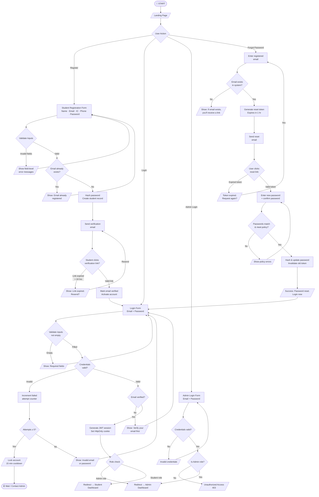
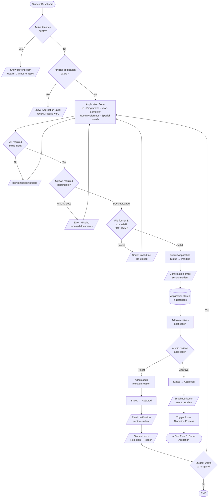
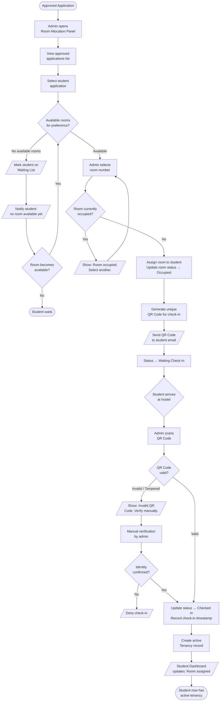
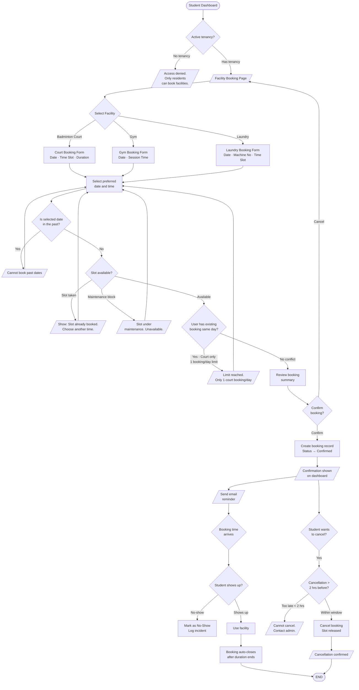
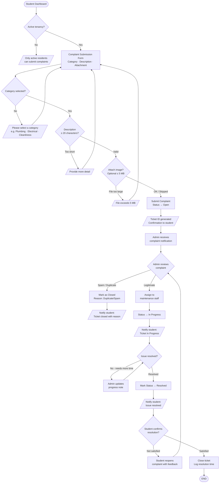
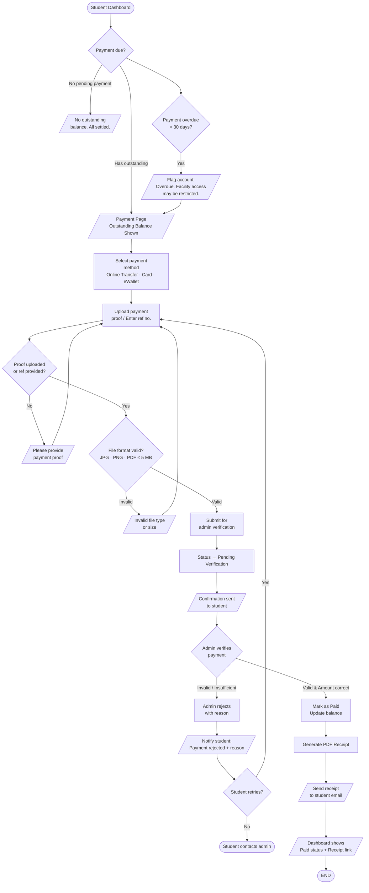
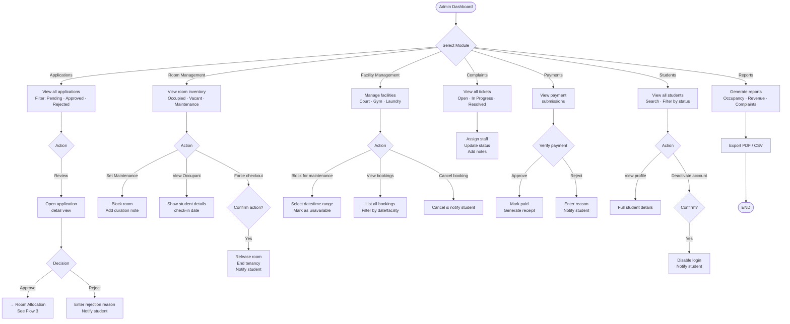
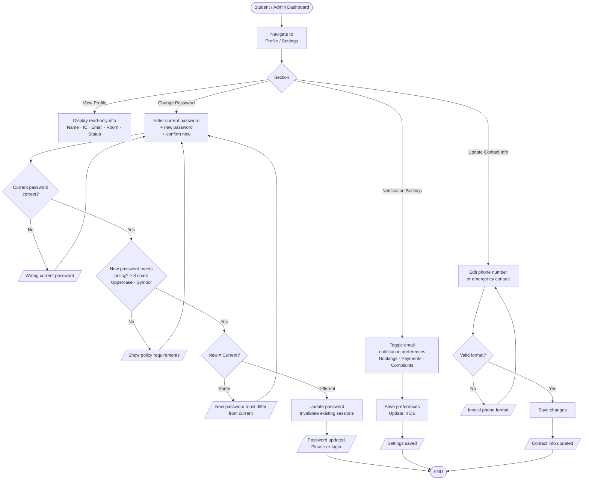

# StayUniKL — Complete User Flowchart
**System Analyst & UX Architect View | FYP Documentation**

---

> [!NOTE]
> This document is split into **7 sub-diagrams** for clarity. Each covers a major functional domain of the StayUniKL hostel management system. All diagrams use Mermaid.js flowchart syntax (`LR` = Left-to-Right, `TD` = Top-Down).

---

## 1. Authentication Flow (Login, Register, Forgot Password)

Covers all three entry points for both Student and Admin roles, including validation, token expiry, and unauthorized access guards.



---

## 2. Student — Hostel Application Flow

Covers the full application lifecycle from eligibility check through admin approval/rejection and room allocation trigger.



---

## 3. Room Allocation & Check-In Flow

Covers admin room assignment, QR code generation, and student check-in.



---

## 4. Facility Booking Flow (Court, Gym, Laundry)

Covers all three facility types with shared booking logic, double-booking prevention, and cancellation.



---

## 5. Complaint Submission & Resolution Flow

Covers submission, admin triage, status updates, and resolution feedback loop.



---

## 6. Payment Flow

Covers payment submission, verification, failed payment handling, and receipt generation.



---

## 7. Admin Management Flows (Overview)

High-level admin control panel flows covering all management domains.



---

## 8. Profile & Settings Management Flow



---

## System-Level Edge Cases Summary

| Edge Case | Trigger | System Response |
|---|---|---|
| **Invalid Login** | Wrong email/password | Show generic error (no info leakage) |
| **Account Lockout** | 5 failed login attempts | Lock 15 min, email notification |
| **Expired Reset Token** | >1 hr after email sent | Prompt to request new link |
| **Unverified Email** | Login before verification | Block login, resend verification option |
| **Unauthorized Access** | Student hits admin route | 403 Forbidden, redirect to dashboard |
| **Double Booking** | Same slot already taken | Real-time conflict check before confirm |
| **Booking 1/day Limit** | Court: >1 booking/day | Block, show limit message |
| **Past Date Booking** | Selecting past date | Disabled/rejected at form level |
| **Failed Payment** | Admin rejects proof | Student notified, can resubmit |
| **Overdue Payment** | >30 days outstanding | Account flagged, facility access restricted |
| **Invalid QR Check-in** | Tampered/wrong QR | Manual verification flow triggered |
| **Expired Tenancy** | After semester ends | Facility booking locked |
| **Large File Upload** | >5 MB file | Rejected at upload, clear error shown |
| **Re-application While Pending** | Existing pending app | Block form, show status |
| **Session Expiry** | JWT expires mid-session | Auto-logout, redirect to login |

---

## 9. Checkout / Tenancy Termination Flow

Covers the move-out process, room inspection, asset return, and final account settlement.

```mermaid
flowchart TD
    A([Student / Admin]) --> B{Trigger Checkout}
    B -->|Student Initiated| C[Submit Checkout Request\nPreferred Date · Reason]
    B -->|Admin Forced\nEnd of Sem / Expulsion| D[Admin Issues\nCheckout Notice]

    C & D --> E[Admin Schedules\nRoom Inspection]
    E --> F[/Notify Student of\nInspection Date/]

    F --> G{Inspection Day}
    G --> H[Admin/Staff Inspects Room\nWalls · Furniture · Lights · Cleanliness]
    
    H --> I{Damages Found?}
    I -->|Yes| J[Record Damages\nTake Photos]
    J --> K[Generate Damage Fine\nAdd to Student Balance]
    K --> L[Student Pays Fine\n(See Flow 6)]
    L --> M
    
    I -->|No| M[Student Returns Assets\nKeys · Access Card · Inventory]
    
    M --> N{Assets Returned?}
    N -->|No| O[Charge Asset\nReplacement Fee]
    O --> L
    N -->|Yes| P[Final Account Review\nCheck all balances = 0]
    
    P --> Q{Balance Clear?}
    Q -->|No| R[/Show Outstanding:\nCannot Close Tenancy/]
    R --> L
    Q -->|Yes| S[Admin Final Approval]
    
    S --> T[Update System Status]
    T --> T1[Room Status → Vacant]
    T --> T2[Tenancy → Closed]
    T --> T3[Student Account → Inactive Tenant]
    
    T3 --> U[/Generate Checkout\nConfirmation PDF/]
    U --> V[/Email Confirmation\nsent to student/]
    
    V --> W([🚀 END OF TENANCY])
```

---

*Generated for StayUniKL FYP | System Analyst & UX Architect View*
*Covers: Authentication · Application · Room Allocation · Facility Booking · Complaints · Payments · Admin · Profile · Checkout*
