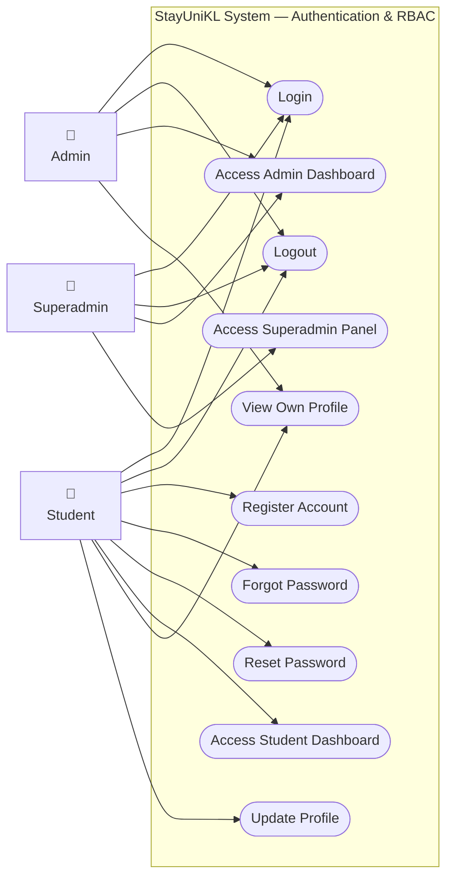
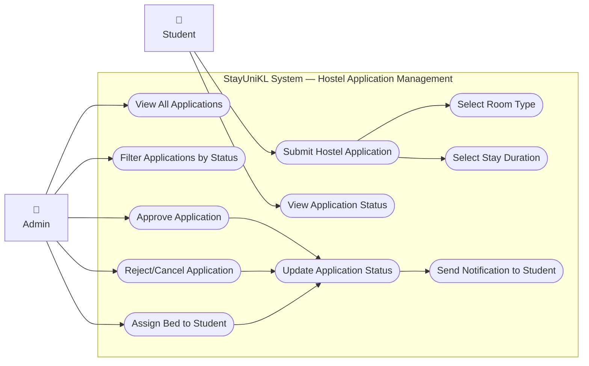
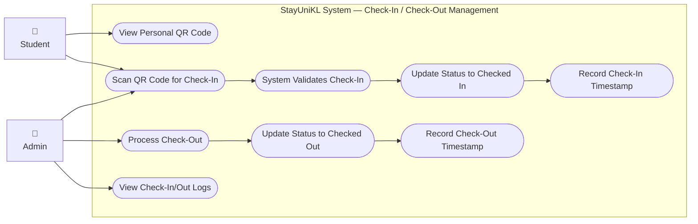
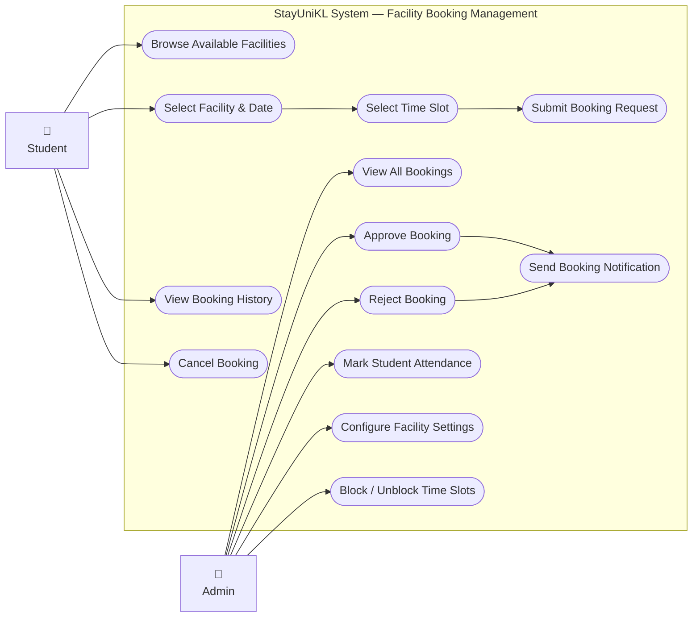
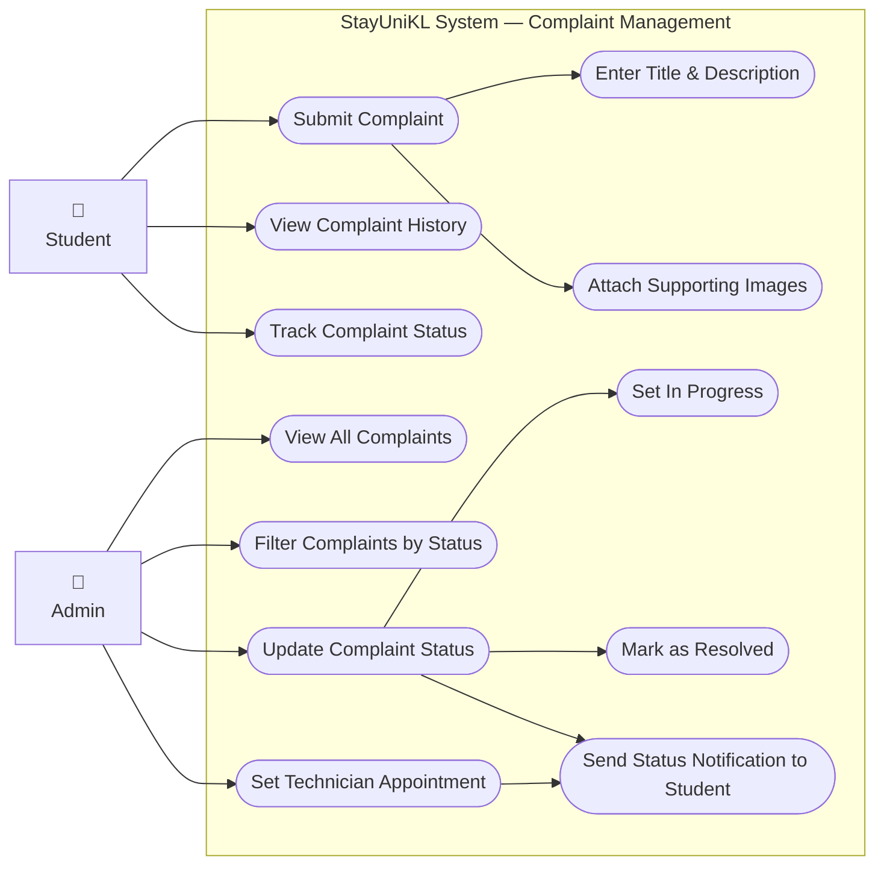
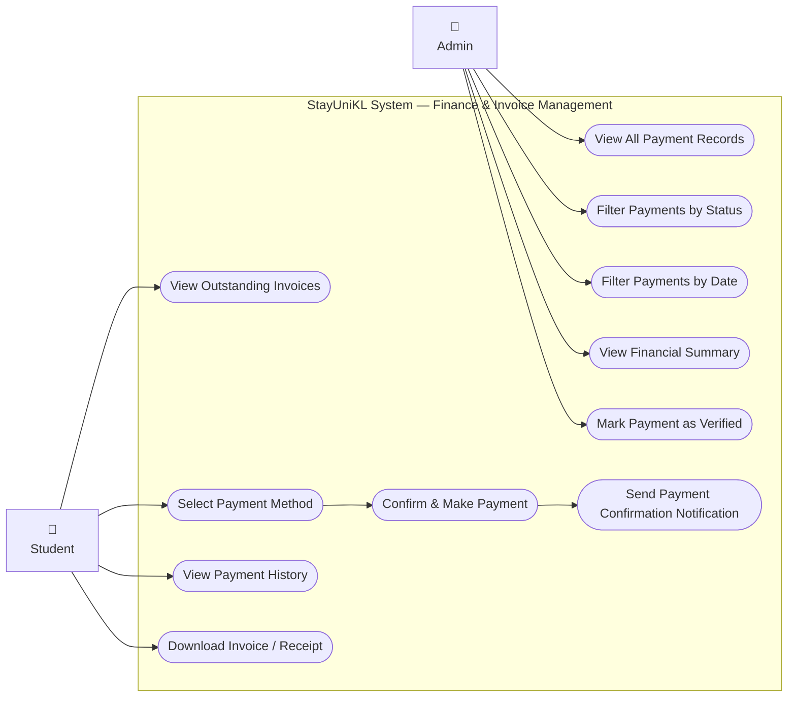
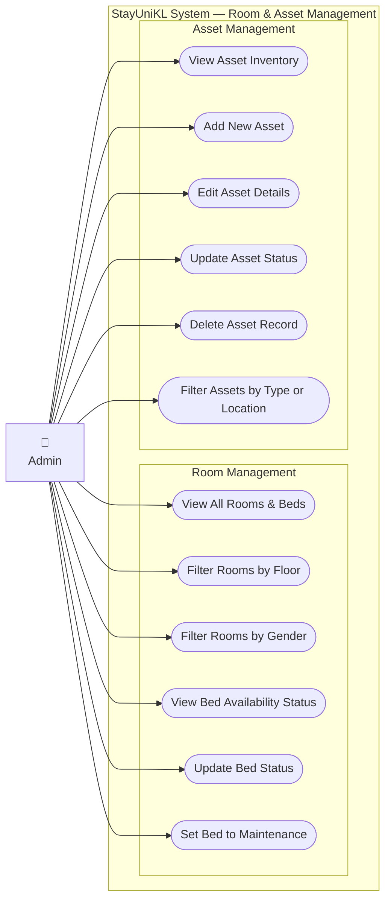
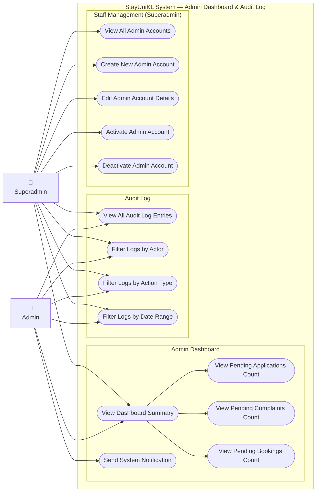

# StayUniKL — Use Case Diagrams
**System:** StayUniKL Digital Hostel Management System
**Document:** Software Test Plan (STP) — Appendix B

---

## Figure 1: Authentication & Role-Based Access Control

---

## Figure 2: Hostel Application Management

---

## Figure 3: Check-In / Check-Out Management

---

## Figure 4: Facility Booking Management

---

## Figure 5: Complaint Management

---

## Figure 6: Finance & Invoice Management

---

## Figure 7: Room & Asset Management

---

## Figure 8: Admin Dashboard & Audit Log

---

*End of Use Case Diagrams — StayUniKL STP Appendix B*
*Figures 1–8 correspond to Sections 4.1–4.8 of the Software Test Plan*
