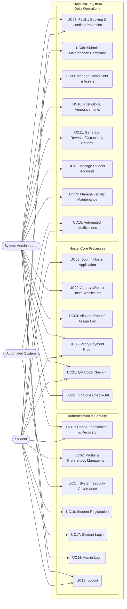

# StayUniKL — Use Case Specifications

This document outlines the detailed use cases and specifications for the StayUniKL Hostel Management System, reflecting the latest architectural updates including security hardening, QR check-ins, and analytics sync.

## 1. System Use Case Diagram

---

## 2. Detailed Use Case Specifications

<table border="1" style="width:100%; border-collapse: collapse; margin-bottom: 2rem;">
  <tr>
    <td style="width:20%;"><strong>Use Case ID</strong></td>
    <td colspan="2">UC_01</td>
  </tr>
  <tr>
    <td><strong>Use Case Name</strong></td>
    <td colspan="2">User Authentication & Recovery</td>
  </tr>
  <tr>
    <td><strong>Description</strong></td>
    <td colspan="2">Allows users to securely log into the system, register an account, or recover a forgotten password.</td>
  </tr>
  <tr>
    <td><strong>Primary Actor</strong></td>
    <td colspan="2">Student, System Administrator</td>
  </tr>
  <tr>
    <td><strong>Include use cases</strong></td>
    <td colspan="2">-</td>
  </tr>
  <tr>
    <td><strong>Pre-Condition</strong></td>
    <td colspan="2">The user is on the landing page or login portal.</td>
  </tr>
  <tr>
    <td><strong>Post-Condition</strong></td>
    <td colspan="2">User session is active. System starts tracking an inactivity timer (15 minutes).</td>
  </tr>
  <tr>
    <td rowspan="7"><strong>Main Flow</strong></td>
    <td style="width:15%;"><strong>Step</strong></td>
    <td><strong>Action</strong></td>
  </tr>
  <tr>
    <td>Pre-Condition</td>
    <td>The user is on the landing page or login portal.</td>
  </tr>
  <tr>
    <td>1.1</td>
    <td>User navigates to the login portal.</td>
  </tr>
  <tr>
    <td>1.2</td>
    <td>User enters credentials (Email & Password).</td>
  </tr>
  <tr>
    <td>1.3</td>
    <td>System validates credentials against strict complexity requirements and rate limits (5 requests/minute).</td>
  </tr>
  <tr>
    <td>1.4</td>
    <td>System generates a JWT session token and redirects to the appropriate dashboard.</td>
  </tr>
  <tr>
    <td>Post-Condition</td>
    <td>User session is active. System starts tracking an inactivity timer (15 minutes).</td>
  </tr>
  <tr>
    <td><strong>Alternate Flow</strong></td>
    <td colspan="2">If the user fails to authenticate 5 consecutive times, the system locks the account for 15 minutes to prevent brute-force attacks.</td>
  </tr>
  <tr>
    <td><strong>Robust Flow</strong></td>
    <td colspan="2">-</td>
  </tr>
</table>

<table border="1" style="width:100%; border-collapse: collapse; margin-bottom: 2rem;">
  <tr>
    <td style="width:20%;"><strong>Use Case ID</strong></td>
    <td colspan="2">UC_02</td>
  </tr>
  <tr>
    <td><strong>Use Case Name</strong></td>
    <td colspan="2">Profile & Preferences Management</td>
  </tr>
  <tr>
    <td><strong>Description</strong></td>
    <td colspan="2">Students can view official system credentials and update personal contact information, emergency contacts, and notification preferences.</td>
  </tr>
  <tr>
    <td><strong>Primary Actor</strong></td>
    <td colspan="2">Student</td>
  </tr>
  <tr>
    <td><strong>Include use cases</strong></td>
    <td colspan="2">-</td>
  </tr>
  <tr>
    <td><strong>Pre-Condition</strong></td>
    <td colspan="2">Student is authenticated and on the Dashboard.</td>
  </tr>
  <tr>
    <td><strong>Post-Condition</strong></td>
    <td colspan="2">Profile data is successfully synchronized.</td>
  </tr>
  <tr>
    <td rowspan="7"><strong>Main Flow</strong></td>
    <td style="width:15%;"><strong>Step</strong></td>
    <td><strong>Action</strong></td>
  </tr>
  <tr>
    <td>Pre-Condition</td>
    <td>Student is authenticated and on the Dashboard.</td>
  </tr>
  <tr>
    <td>1.1</td>
    <td>Student navigates to "Settings Hub".</td>
  </tr>
  <tr>
    <td>1.2</td>
    <td>Student updates address, phone number, or emergency contacts.</td>
  </tr>
  <tr>
    <td>1.3</td>
    <td>Student toggles notification preferences (e.g., Booking Alerts, Maintenance Updates).</td>
  </tr>
  <tr>
    <td>1.4</td>
    <td>System saves updates to the database.</td>
  </tr>
  <tr>
    <td>Post-Condition</td>
    <td>Profile data is successfully synchronized.</td>
  </tr>
  <tr>
    <td><strong>Alternate Flow</strong></td>
    <td colspan="2">-</td>
  </tr>
  <tr>
    <td><strong>Robust Flow</strong></td>
    <td colspan="2">-</td>
  </tr>
</table>

<table border="1" style="width:100%; border-collapse: collapse; margin-bottom: 2rem;">
  <tr>
    <td style="width:20%;"><strong>Use Case ID</strong></td>
    <td colspan="2">UC_03 (UC-HOSTEL-01)</td>
  </tr>
  <tr>
    <td><strong>Use Case Name</strong></td>
    <td colspan="2">Submit Hostel Application</td>
  </tr>
  <tr>
    <td><strong>Description</strong></td>
    <td colspan="2">Allows an authenticated student to apply for hostel accommodation by selecting room preferences and submitting their details.</td>
  </tr>
  <tr>
    <td><strong>Primary Actor</strong></td>
    <td colspan="2">Student</td>
  </tr>
  <tr>
    <td><strong>Include use cases</strong></td>
    <td colspan="2">-</td>
  </tr>
  <tr>
    <td><strong>Pre-Condition</strong></td>
    <td colspan="2">Student is authenticated, does not currently hold an active application or stay in the system, and an active application session is open.</td>
  </tr>
  <tr>
    <td><strong>Post-Condition</strong></td>
    <td colspan="2">A pending application record is created in the database, the selected bed status is set to "Occupied", and the student is notified.</td>
  </tr>
  <tr>
    <td rowspan="9"><strong>Main Flow</strong></td>
    <td style="width:15%;"><strong>Step</strong></td>
    <td><strong>Action</strong></td>
  </tr>
  <tr>
    <td>Pre-Condition</td>
    <td>Student is authenticated and navigates to the hostel application portal.</td>
  </tr>
  <tr>
    <td>1.1</td>
    <td>Student completes the application form by selecting Room Type, Floor, Room, Bed, and Payment Method (Full Payment or Installment Plan).</td>
  </tr>
  <tr>
    <td>1.2</td>
    <td>System validates that the student gender matches the selected room's designated gender.</td>
  </tr>
  <tr>
    <td>1.3</td>
    <td>System verifies that an active application session is open and checks the student's eligibility (New vs Returning intake rules).</td>
  </tr>
  <tr>
    <td>1.4</td>
    <td>System starts a database transaction and obtains a FOR UPDATE row lock on the selected bed to prevent double-booking.</td>
  </tr>
  <tr>
    <td>1.5</td>
    <td>System inserts a new application record with status 'Pending' and payment_status 'Pending' (fixed RM600 semester fee).</td>
  </tr>
  <tr>
    <td>1.6</td>
    <td>System updates the bed status to 'Occupied', generates a notification for the student, and logs the action in the audit trail.</td>
  </tr>
  <tr>
    <td>Post-Condition</td>
    <td>The student is redirected to their dashboard displaying the pending application status.</td>
  </tr>
  <tr>
    <td><strong>Alternate Flow</strong></td>
    <td colspan="2">
      - **Closed/Ineligible Session**: If no application session is open or the student fails eligibility checks, the system blocks form submission and displays an intake warning. 
      - **Existing Active Application**: If the student already has an application in "Pending", "Payment Pending", "Approved", or "Checked in" status, the system blocks submission with a 400 Bad Request error. 
      - **Gender Mismatch**: If student gender does not match room gender, system rejects submission. 
      - **Bed Unavailable**: If the selected bed is already occupied/reserved, system rolls back the transaction and warns the student to select another bed.
    </td>
  </tr>
  <tr>
    <td><strong>Robust Flow</strong></td>
    <td colspan="2">-</td>
  </tr>
</table>

<table border="1" style="width:100%; border-collapse: collapse; margin-bottom: 2rem;">
  <tr>
    <td style="width:20%;"><strong>Use Case ID</strong></td>
    <td colspan="2">UC_20 (UC-HOSTEL-02)</td>
  </tr>
  <tr>
    <td><strong>Use Case Name</strong></td>
    <td colspan="2">Admin Approve/Reject Application</td>
  </tr>
  <tr>
    <td><strong>Description</strong></td>
    <td colspan="2">Allows system administrators to review pending student applications and either approve them (requesting payment) or reject/cancel them.</td>
  </tr>
  <tr>
    <td><strong>Primary Actor</strong></td>
    <td colspan="2">System Administrator</td>
  </tr>
  <tr>
    <td><strong>Include use cases</strong></td>
    <td colspan="2">-</td>
  </tr>
  <tr>
    <td><strong>Pre-Condition</strong></td>
    <td colspan="2">Admin is authenticated. Student applications exist in the system with status 'Pending'.</td>
  </tr>
  <tr>
    <td><strong>Post-Condition</strong></td>
    <td colspan="2">Application status is updated in the database. If approved, invoices are generated and the bed remains "Occupied". If rejected, the bed is set to "Available" and the reservation is released.</td>
  </tr>
  <tr>
    <td rowspan="9"><strong>Main Flow</strong></td>
    <td style="width:15%;"><strong>Step</strong></td>
    <td><strong>Action</strong></td>
  </tr>
  <tr>
    <td>Pre-Condition</td>
    <td>Admin is on the Student Enrollment portal of the Admin Dashboard.</td>
  </tr>
  <tr>
    <td>2.1</td>
    <td>Admin reviews a student's pending application details.</td>
  </tr>
  <tr>
    <td>2.2</td>
    <td>Admin clicks "Accept" to approve or "Reject" to decline the application.</td>
  </tr>
  <tr>
    <td>2.3</td>
    <td>If Admin accepts: System updates application status to "Payment Pending" and triggers the billing module to generate hostel fee invoices based on the selected payment method.</td>
  </tr>
  <tr>
    <td>2.4</td>
    <td>If Admin rejects: Admin provides a rejection reason. System updates application status to "Cancelled" or "Rejected", clears the bed and room links on the application, and sets the bed status back to "Available".</td>
  </tr>
  <tr>
    <td>2.5</td>
    <td>System commits the database transaction.</td>
  </tr>
  <tr>
    <td>2.6</td>
    <td>System sends a customized notification to the student (success/error type) and creates an audit log entry.</td>
  </tr>
  <tr>
    <td>Post-Condition</td>
    <td>The application status is updated and the student is notified.</td>
  </tr>
  <tr>
    <td><strong>Alternate Flow</strong></td>
    <td colspan="2">
      - **Bulk Operations**: Admin selects multiple applications in the list view and clicks "Bulk Accept" or "Bulk Reject" to process all selected items in a single batch transaction.
    </td>
  </tr>
  <tr>
    <td><strong>Robust Flow</strong></td>
    <td colspan="2">-</td>
  </tr>
</table>

<table border="1" style="width:100%; border-collapse: collapse; margin-bottom: 2rem;">
  <tr>
    <td style="width:20%;"><strong>Use Case ID</strong></td>
    <td colspan="2">UC_04 (UC-HOSTEL-03)</td>
  </tr>
  <tr>
    <td><strong>Use Case Name</strong></td>
    <td colspan="2">Admin Assign Bed</td>
  </tr>
  <tr>
    <td><strong>Description</strong></td>
    <td colspan="2">Allows system administrators to manually assign an available room and bed to a student, bypassing the student application flow.</td>
  </tr>
  <tr>
    <td><strong>Primary Actor</strong></td>
    <td colspan="2">System Administrator</td>
  </tr>
  <tr>
    <td><strong>Include use cases</strong></td>
    <td colspan="2">-</td>
  </tr>
  <tr>
    <td><strong>Pre-Condition</strong></td>
    <td colspan="2">Admin is authenticated. Selected room has vacancy and student does not have an active accommodation.</td>
  </tr>
  <tr>
    <td><strong>Post-Condition</strong></td>
    <td colspan="2">A new application is created in 'Payment Pending' status, the bed is marked as 'Occupied', an invoice is generated, and the student is notified.</td>
  </tr>
  <tr>
    <td rowspan="9"><strong>Main Flow</strong></td>
    <td style="width:15%;"><strong>Step</strong></td>
    <td><strong>Action</strong></td>
  </tr>
  <tr>
    <td>Pre-Condition</td>
    <td>Admin navigates to the Room Matrix floor plan or clicks "Assign Bed" on the Admin Dashboard.</td>
  </tr>
  <tr>
    <td>3.1</td>
    <td>Admin enters the target student's ID and selects a vacant room and bed.</td>
  </tr>
  <tr>
    <td>3.2</td>
    <td>System checks if the student already has an active application or assignment.</td>
  </tr>
  <tr>
    <td>3.3</td>
    <td>System validates that the student gender matches the selected room designated gender.</td>
  </tr>
  <tr>
    <td>3.4</td>
    <td>System inserts a new application record with status 'Payment Pending' and payment_status 'Pending' (RM600 semester fee).</td>
  </tr>
  <tr>
    <td>3.5</td>
    <td>System creates an unpaid hostel fee invoice (INV-APP-...) linked to the student.</td>
  </tr>
  <tr>
    <td>3.6</td>
    <td>System sets the selected bed status to 'Occupied' in the database.</td>
  </tr>
  <tr>
    <td>3.7</td>
    <td>System logs the action in the audit trail and sends a success notification to the student.</td>
  </tr>
  <tr>
    <td>Post-Condition</td>
    <td>The student is assigned to the bed and their dashboard shows the active billing invoice.</td>
  </tr>
  <tr>
    <td><strong>Alternate Flow</strong></td>
    <td colspan="2">
      - **Existing Accommodation**: If the target student already holds an active application/stay, the system rolls back and displays "Student already has an active application". 
      - **Gender Mismatch**: If the student's gender does not match the room's gender restriction, the system blocks assignment and returns a gender mismatch error.
    </td>
  </tr>
  <tr>
    <td><strong>Robust Flow</strong></td>
    <td colspan="2">-</td>
  </tr>
</table>

<table border="1" style="width:100%; border-collapse: collapse; margin-bottom: 2rem;">
  <tr>
    <td style="width:20%;"><strong>Use Case ID</strong></td>
    <td colspan="2">UC_05</td>
  </tr>
  <tr>
    <td><strong>Use Case Name</strong></td>
    <td colspan="2">Verify Payment Proof</td>
  </tr>
  <tr>
    <td><strong>Description</strong></td>
    <td colspan="2">Student uploads a receipt for hostel fees, and Admin reviews it to clear the balance.</td>
  </tr>
  <tr>
    <td><strong>Primary Actor</strong></td>
    <td colspan="2">Student (Uploads), Admin (Verifies)</td>
  </tr>
  <tr>
    <td><strong>Include use cases</strong></td>
    <td colspan="2">-</td>
  </tr>
  <tr>
    <td><strong>Pre-Condition</strong></td>
    <td colspan="2">Application is in "Payment Pending" state.</td>
  </tr>
  <tr>
    <td><strong>Post-Condition</strong></td>
    <td colspan="2">Student balance clears to 0. A formal PDF receipt is generated.</td>
  </tr>
  <tr>
    <td rowspan="7"><strong>Main Flow</strong></td>
    <td style="width:15%;"><strong>Step</strong></td>
    <td><strong>Action</strong></td>
  </tr>
  <tr>
    <td>Pre-Condition</td>
    <td>Application is in "Payment Pending" state.</td>
  </tr>
  <tr>
    <td>1.1</td>
    <td>Student views outstanding balance in the Financials tab.</td>
  </tr>
  <tr>
    <td>1.2</td>
    <td>Student uploads an image/PDF of the payment receipt.</td>
  </tr>
  <tr>
    <td>1.3</td>
    <td>Admin reviews the document via the Admin portal.</td>
  </tr>
  <tr>
    <td>1.4</td>
    <td>Admin clicks "Approve" (or "Reject" with reason).</td>
  </tr>
  <tr>
    <td>Post-Condition</td>
    <td>Student balance clears to 0. A formal PDF receipt is generated.</td>
  </tr>
  <tr>
    <td><strong>Alternate Flow</strong></td>
    <td colspan="2">-</td>
  </tr>
  <tr>
    <td><strong>Robust Flow</strong></td>
    <td colspan="2">-</td>
  </tr>
</table>

<table border="1" style="width:100%; border-collapse: collapse; margin-bottom: 2rem;">
  <tr>
    <td style="width:20%;"><strong>Use Case ID</strong></td>
    <td colspan="2">UC_06</td>
  </tr>
  <tr>
    <td><strong>Use Case Name</strong></td>
    <td colspan="2">QR Code Check-In</td>
  </tr>
  <tr>
    <td><strong>Description</strong></td>
    <td colspan="2">Secure, automated check-in process on arrival day.</td>
  </tr>
  <tr>
    <td><strong>Primary Actor</strong></td>
    <td colspan="2">Student (Presents), Admin (Scans)</td>
  </tr>
  <tr>
    <td><strong>Include use cases</strong></td>
    <td colspan="2">-</td>
  </tr>
  <tr>
    <td><strong>Pre-Condition</strong></td>
    <td colspan="2">Student has been allocated a room and has a valid QR code on their dashboard.</td>
  </tr>
  <tr>
    <td><strong>Post-Condition</strong></td>
    <td colspan="2">Tenancy officially begins.</td>
  </tr>
  <tr>
    <td rowspan="7"><strong>Main Flow</strong></td>
    <td style="width:15%;"><strong>Step</strong></td>
    <td><strong>Action</strong></td>
  </tr>
  <tr>
    <td>Pre-Condition</td>
    <td>Student has been allocated a room and has a valid QR code on their dashboard.</td>
  </tr>
  <tr>
    <td>1.1</td>
    <td>Student opens dashboard and presents the Check-in QR code.</td>
  </tr>
  <tr>
    <td>1.2</td>
    <td>Admin uses the Mobile Scanner portal to scan the code.</td>
  </tr>
  <tr>
    <td>1.3</td>
    <td>System decrypts the JWT payload and verifies expiration.</td>
  </tr>
  <tr>
    <td>1.4</td>
    <td>System marks the student as "Checked In".</td>
  </tr>
  <tr>
    <td>Post-Condition</td>
    <td>Tenancy officially begins.</td>
  </tr>
  <tr>
    <td><strong>Alternate Flow</strong></td>
    <td colspan="2">-</td>
  </tr>
  <tr>
    <td><strong>Robust Flow</strong></td>
    <td colspan="2">-</td>
  </tr>
</table>

<table border="1" style="width:100%; border-collapse: collapse; margin-bottom: 2rem;">
  <tr>
    <td style="width:20%;"><strong>Use Case ID</strong></td>
    <td colspan="2">UC_07</td>
  </tr>
  <tr>
    <td><strong>Use Case Name</strong></td>
    <td colspan="2">Facility Booking & Conflict Prevention</td>
  </tr>
  <tr>
    <td><strong>Description</strong></td>
    <td colspan="2">Students can reserve time slots for facilities (e.g., Badminton Court, Gym) while the system prevents double-booking. Admin can block slots.</td>
  </tr>
  <tr>
    <td><strong>Primary Actor</strong></td>
    <td colspan="2">Student, Admin (Blocking)</td>
  </tr>
  <tr>
    <td><strong>Include use cases</strong></td>
    <td colspan="2">-</td>
  </tr>
  <tr>
    <td><strong>Pre-Condition</strong></td>
    <td colspan="2">Facility is active.</td>
  </tr>
  <tr>
    <td><strong>Post-Condition</strong></td>
    <td colspan="2">Slot is permanently booked.</td>
  </tr>
  <tr>
    <td rowspan="7"><strong>Main Flow</strong></td>
    <td style="width:15%;"><strong>Step</strong></td>
    <td><strong>Action</strong></td>
  </tr>
  <tr>
    <td>Pre-Condition</td>
    <td>Facility is active.</td>
  </tr>
  <tr>
    <td>1.1</td>
    <td>Student views the calendar grid.</td>
  </tr>
  <tr>
    <td>1.2</td>
    <td>Student selects an available 1-hour time slot.</td>
  </tr>
  <tr>
    <td>1.3</td>
    <td>System locks the slot transactionally to prevent concurrency conflicts.</td>
  </tr>
  <tr>
    <td>1.4</td>
    <td>System confirms booking.</td>
  </tr>
  <tr>
    <td>Post-Condition</td>
    <td>Slot is permanently booked.</td>
  </tr>
  <tr>
    <td><strong>Alternate Flow</strong></td>
    <td colspan="2">Admin selects a slot and clicks "Set as Maintenance". The slot becomes greyed out and unavailable for all students.</td>
  </tr>
  <tr>
    <td><strong>Robust Flow</strong></td>
    <td colspan="2">-</td>
  </tr>
</table>

<table border="1" style="width:100%; border-collapse: collapse; margin-bottom: 2rem;">
  <tr>
    <td style="width:20%;"><strong>Use Case ID</strong></td>
    <td colspan="2">UC_08</td>
  </tr>
  <tr>
    <td><strong>Use Case Name</strong></td>
    <td colspan="2">Submit Maintenance Complaint</td>
  </tr>
  <tr>
    <td><strong>Description</strong></td>
    <td colspan="2">Students can log issues (plumbing, electrical, furniture) occurring in their assigned rooms.</td>
  </tr>
  <tr>
    <td><strong>Primary Actor</strong></td>
    <td colspan="2">Student</td>
  </tr>
  <tr>
    <td><strong>Include use cases</strong></td>
    <td colspan="2">-</td>
  </tr>
  <tr>
    <td><strong>Pre-Condition</strong></td>
    <td colspan="2">Student is checked into a room.</td>
  </tr>
  <tr>
    <td><strong>Post-Condition</strong></td>
    <td colspan="2">Complaint is logged.</td>
  </tr>
  <tr>
    <td rowspan="6"><strong>Main Flow</strong></td>
    <td style="width:15%;"><strong>Step</strong></td>
    <td><strong>Action</strong></td>
  </tr>
  <tr>
    <td>Pre-Condition</td>
    <td>Student is checked into a room.</td>
  </tr>
  <tr>
    <td>1.1</td>
    <td>Student navigates to Complaints.</td>
  </tr>
  <tr>
    <td>1.2</td>
    <td>Student describes the issue, selects category, and optionally uploads a photo.</td>
  </tr>
  <tr>
    <td>1.3</td>
    <td>System automatically ties the complaint to the student's assigned room.</td>
  </tr>
  <tr>
    <td>Post-Condition</td>
    <td>Complaint is logged.</td>
  </tr>
  <tr>
    <td><strong>Alternate Flow</strong></td>
    <td colspan="2">-</td>
  </tr>
  <tr>
    <td><strong>Robust Flow</strong></td>
    <td colspan="2">-</td>
  </tr>
</table>

<table border="1" style="width:100%; border-collapse: collapse; margin-bottom: 2rem;">
  <tr>
    <td style="width:20%;"><strong>Use Case ID</strong></td>
    <td colspan="2">UC_09</td>
  </tr>
  <tr>
    <td><strong>Use Case Name</strong></td>
    <td colspan="2">Manage Complaints & Assets</td>
  </tr>
  <tr>
    <td><strong>Description</strong></td>
    <td colspan="2">Admin resolves complaints, which automatically syncs with Room Asset Conditions.</td>
  </tr>
  <tr>
    <td><strong>Primary Actor</strong></td>
    <td colspan="2">Admin</td>
  </tr>
  <tr>
    <td><strong>Include use cases</strong></td>
    <td colspan="2">-</td>
  </tr>
  <tr>
    <td><strong>Pre-Condition</strong></td>
    <td colspan="2">Active complaints exist.</td>
  </tr>
  <tr>
    <td><strong>Post-Condition</strong></td>
    <td colspan="2">Asset analytics accurately reflect current hostel integrity.</td>
  </tr>
  <tr>
    <td rowspan="7"><strong>Main Flow</strong></td>
    <td style="width:15%;"><strong>Step</strong></td>
    <td><strong>Action</strong></td>
  </tr>
  <tr>
    <td>Pre-Condition</td>
    <td>Active complaints exist.</td>
  </tr>
  <tr>
    <td>1.1</td>
    <td>Admin reviews a new complaint.</td>
  </tr>
  <tr>
    <td>1.2</td>
    <td>The system automatically flags the related Room Asset Condition to "Needs Repair" based on database collation sync.</td>
  </tr>
  <tr>
    <td>1.3</td>
    <td>Admin marks complaint as "Resolved".</td>
  </tr>
  <tr>
    <td>1.4</td>
    <td>Room asset status returns to "Good".</td>
  </tr>
  <tr>
    <td>Post-Condition</td>
    <td>Asset analytics accurately reflect current hostel integrity.</td>
  </tr>
  <tr>
    <td><strong>Alternate Flow</strong></td>
    <td colspan="2">-</td>
  </tr>
  <tr>
    <td><strong>Robust Flow</strong></td>
    <td colspan="2">-</td>
  </tr>
</table>

<table border="1" style="width:100%; border-collapse: collapse; margin-bottom: 2rem;">
  <tr>
    <td style="width:20%;"><strong>Use Case ID</strong></td>
    <td colspan="2">UC_10</td>
  </tr>
  <tr>
    <td><strong>Use Case Name</strong></td>
    <td colspan="2">Post Global Announcements</td>
  </tr>
  <tr>
    <td><strong>Description</strong></td>
    <td colspan="2">Admin broadcasts critical information to all students.</td>
  </tr>
  <tr>
    <td><strong>Primary Actor</strong></td>
    <td colspan="2">Admin</td>
  </tr>
  <tr>
    <td><strong>Include use cases</strong></td>
    <td colspan="2">-</td>
  </tr>
  <tr>
    <td><strong>Pre-Condition</strong></td>
    <td colspan="2">None.</td>
  </tr>
  <tr>
    <td><strong>Post-Condition</strong></td>
    <td colspan="2">Students see the announcement on their dashboard hero banner.</td>
  </tr>
  <tr>
    <td rowspan="5"><strong>Main Flow</strong></td>
    <td style="width:15%;"><strong>Step</strong></td>
    <td><strong>Action</strong></td>
  </tr>
  <tr>
    <td>Pre-Condition</td>
    <td>None.</td>
  </tr>
  <tr>
    <td>1.1</td>
    <td>Admin writes a title, content, and sets a priority level (e.g., High, Normal).</td>
  </tr>
  <tr>
    <td>1.2</td>
    <td>System pushes the announcement to the student feed.</td>
  </tr>
  <tr>
    <td>Post-Condition</td>
    <td>Students see the announcement on their dashboard hero banner.</td>
  </tr>
  <tr>
    <td><strong>Alternate Flow</strong></td>
    <td colspan="2">-</td>
  </tr>
  <tr>
    <td><strong>Robust Flow</strong></td>
    <td colspan="2">-</td>
  </tr>
</table>

<table border="1" style="width:100%; border-collapse: collapse; margin-bottom: 2rem;">
  <tr>
    <td style="width:20%;"><strong>Use Case ID</strong></td>
    <td colspan="2">UC_11</td>
  </tr>
  <tr>
    <td><strong>Use Case Name</strong></td>
    <td colspan="2">Generate Revenue/Occupancy Reports</td>
  </tr>
  <tr>
    <td><strong>Description</strong></td>
    <td colspan="2">Admin exports aggregated system analytics for management review.</td>
  </tr>
  <tr>
    <td><strong>Primary Actor</strong></td>
    <td colspan="2">Admin</td>
  </tr>
  <tr>
    <td><strong>Include use cases</strong></td>
    <td colspan="2">-</td>
  </tr>
  <tr>
    <td><strong>Pre-Condition</strong></td>
    <td colspan="2">System has historical data.</td>
  </tr>
  <tr>
    <td><strong>Post-Condition</strong></td>
    <td colspan="2">File downloads successfully to the Admin's local machine.</td>
  </tr>
  <tr>
    <td rowspan="6"><strong>Main Flow</strong></td>
    <td style="width:15%;"><strong>Step</strong></td>
    <td><strong>Action</strong></td>
  </tr>
  <tr>
    <td>Pre-Condition</td>
    <td>System has historical data.</td>
  </tr>
  <tr>
    <td>1.1</td>
    <td>Admin selects date ranges on the Analytics dashboard.</td>
  </tr>
  <tr>
    <td>1.2</td>
    <td>Admin clicks "Export PDF/CSV".</td>
  </tr>
  <tr>
    <td>1.3</td>
    <td>System compiles total revenue, current occupancy rates, and active maintenance counts into a structured file.</td>
  </tr>
  <tr>
    <td>Post-Condition</td>
    <td>File downloads successfully to the Admin's local machine.</td>
  </tr>
  <tr>
    <td><strong>Alternate Flow</strong></td>
    <td colspan="2">-</td>
  </tr>
  <tr>
    <td><strong>Robust Flow</strong></td>
    <td colspan="2">-</td>
  </tr>
</table>

<!-- UC12: Manage Student Accounts -->
<table border="1" style="width:100%; border-collapse: collapse; margin-bottom: 2rem;">
  <tr>
    <td style="width:20%;"><strong>Use Case ID</strong></td>
    <td colspan="2">UC_12</td>
  </tr>
  <tr>
    <td><strong>Use Case Name</strong></td>
    <td colspan="2">Manage Student Accounts</td>
  </tr>
  <tr>
    <td><strong>Description</strong></td>
    <td colspan="2">Allows Admin to monitor, search, and manage student account statuses (Activate/Deactivate).</td>
  </tr>
  <tr>
    <td><strong>Primary Actor</strong></td>
    <td colspan="2">System Administrator</td>
  </tr>
  <tr>
    <td><strong>Include use cases</strong></td>
    <td colspan="2">-</td>
  </tr>
  <tr>
    <td><strong>Pre-Condition</strong></td>
    <td colspan="2">Admin is authenticated with administrative privileges.</td>
  </tr>
  <tr>
    <td><strong>Post-Condition</strong></td>
    <td colspan="2">Student account status is updated in the database and reflected in the UI.</td>
  </tr>
  <tr>
    <td rowspan="7"><strong>Main Flow</strong></td>
    <td style="width:15%;"><strong>Step</strong></td>
    <td><strong>Action</strong></td>
  </tr>
  <tr>
    <td>Pre-Condition</td>
    <td>Admin is authenticated with administrative privileges.</td>
  </tr>
  <tr>
    <td>1</td>
    <td>Admin navigates to the "Student Management" module.</td>
  </tr>
  <tr>
    <td>2</td>
    <td>Admin searches for a student by Name or ID.</td>
  </tr>
  <tr>
    <td>3</td>
    <td>Admin clicks on the "Toggle Status" (Deactivate/Activate) button.</td>
  </tr>
  <tr>
    <td>4</td>
    <td>System prompts for confirmation and updates the record.</td>
  </tr>
  <tr>
    <td>Post-Condition</td>
    <td>Student account status is updated in the database and reflected in the UI.</td>
  </tr>
</table>

<!-- UC13: Manage Facility Maintenance -->
<table border="1" style="width:100%; border-collapse: collapse; margin-bottom: 2rem;">
  <tr>
    <td style="width:20%;"><strong>Use Case ID</strong></td>
    <td colspan="2">UC_13</td>
  </tr>
  <tr>
    <td><strong>Use Case Name</strong></td>
    <td colspan="2">Manage Facility Maintenance</td>
  </tr>
  <tr>
    <td><strong>Description</strong></td>
    <td colspan="2">Allows Admin to block specific facility time slots for repair or maintenance.</td>
  </tr>
  <tr>
    <td><strong>Primary Actor</strong></td>
    <td colspan="2">System Administrator</td>
  </tr>
  <tr>
    <td><strong>Pre-Condition</strong></td>
    <td colspan="2">Admin is on the Facility Management dashboard.</td>
  </tr>
  <tr>
    <td><strong>Post-Condition</strong></td>
    <td colspan="2">Specific slots are marked as "Unavailable" for student booking.</td>
  </tr>
  <tr>
    <td rowspan="7"><strong>Main Flow</strong></td>
    <td style="width:15%;"><strong>Step</strong></td>
    <td><strong>Action</strong></td>
  </tr>
  <tr>
    <td>Pre-Condition</td>
    <td>Admin is on the Facility Management dashboard.</td>
  </tr>
  <tr>
    <td>1</td>
    <td>Admin selects a facility (e.g., Badminton Court).</td>
  </tr>
  <tr>
    <td>2</td>
    <td>Admin views the schedule calendar.</td>
  </tr>
  <tr>
    <td>3</td>
    <td>Admin selects a time slot and clicks "Set Maintenance".</td>
  </tr>
  <tr>
    <td>4</td>
    <td>System blocks the slot using row-level locking to prevent race conditions.</td>
  </tr>
  <tr>
    <td>Post-Condition</td>
    <td>Specific slots are marked as "Unavailable" for student booking.</td>
  </tr>
</table>

<!-- UC14: System Security Governance -->
<table border="1" style="width:100%; border-collapse: collapse; margin-bottom: 2rem;">
  <tr>
    <td style="width:20%;"><strong>Use Case ID</strong></td>
    <td colspan="2">UC_14</td>
  </tr>
  <tr>
    <td><strong>Use Case Name</strong></td>
    <td colspan="2">System Security Governance</td>
  </tr>
  <tr>
    <td><strong>Description</strong></td>
    <td colspan="2">The system monitors API requests and login attempts to prevent brute-force attacks.</td>
  </tr>
  <tr>
    <td><strong>Primary Actor</strong></td>
    <td colspan="2">System (Automated)</td>
  </tr>
  <tr>
    <td><strong>Pre-Condition</strong></td>
    <td colspan="2">System is active and monitoring traffic.</td>
  </tr>
  <tr>
    <td><strong>Post-Condition</strong></td>
    <td colspan="2">Unauthorized or excessive requests are throttled (HTTP 429).</td>
  </tr>
  <tr>
    <td rowspan="6"><strong>Main Flow</strong></td>
    <td style="width:15%;"><strong>Step</strong></td>
    <td><strong>Action</strong></td>
  </tr>
  <tr>
    <td>Pre-Condition</td>
    <td>System is active and monitoring traffic.</td>
  </tr>
  <tr>
    <td>1</td>
    <td>User sends multiple rapid requests to the login/API endpoint.</td>
  </tr>
  <tr>
    <td>2</td>
    <td>System middleware detects the threshold violation.</td>
  </tr>
  <tr>
    <td>3</td>
    <td>System returns "Too Many Requests" and logs the incident.</td>
  </tr>
  <tr>
    <td>Post-Condition</td>
    <td>Unauthorized or excessive requests are throttled (HTTP 429).</td>
  </tr>
</table>

<!-- UC15: Automated Notifications -->
<table border="1" style="width:100%; border-collapse: collapse; margin-bottom: 2rem;">
  <tr>
    <td style="width:20%;"><strong>Use Case ID</strong></td>
    <td colspan="2">UC_15</td>
  </tr>
  <tr>
    <td><strong>Use Case Name</strong></td>
    <td colspan="2">Automated Notifications</td>
  </tr>
  <tr>
    <td><strong>Description</strong></td>
    <td colspan="2">The system notifies students of status changes in their applications or bookings.</td>
  </tr>
  <tr>
    <td><strong>Primary Actor</strong></td>
    <td colspan="2">System (Automated)</td>
  </tr>
  <tr>
    <td><strong>Pre-Condition</strong></td>
    <td colspan="2">A data event occurs (e.g., Application Approved).</td>
  </tr>
  <tr>
    <td><strong>Post-Condition</strong></td>
    <td colspan="2">Notification is displayed on the Student Dashboard.</td>
  </tr>
  <tr>
    <td rowspan="6"><strong>Main Flow</strong></td>
    <td style="width:15%;"><strong>Step</strong></td>
    <td><strong>Action</strong></td>
  </tr>
  <tr>
    <td>Pre-Condition</td>
    <td>A data event occurs (e.g., Application Approved).</td>
  </tr>
  <tr>
    <td>1</td>
    <td>System detects a status update in the database.</td>
  </tr>
  <tr>
    <td>2</td>
    <td>System creates a notification record linked to the student ID.</td>
  </tr>
  <tr>
    <td>3</td>
    <td>Student Dashboard fetches and displays the alert in real-time.</td>
  </tr>
  <tr>
    <td>Post-Condition</td>
    <td>Notification is displayed on the Student Dashboard.</td>
  </tr>
</table>

<!-- UC16: Student Registration -->
<table border="1" style="width:100%; border-collapse: collapse; margin-bottom: 2rem;">
  <tr>
    <td style="width:20%;"><strong>Use Case ID</strong></td>
    <td colspan="2">UC_16 (UC-AUTH-01)</td>
  </tr>
  <tr>
    <td><strong>Use Case Name</strong></td>
    <td colspan="2">Student Registration</td>
  </tr>
  <tr>
    <td><strong>Description</strong></td>
    <td colspan="2">Allows a student to securely register a new account in the system using their UniKL email, NRIC/Passport, and student credentials.</td>
  </tr>
  <tr>
    <td><strong>Primary Actor</strong></td>
    <td colspan="2">Student</td>
  </tr>
  <tr>
    <td><strong>Include use cases</strong></td>
    <td colspan="2">-</td>
  </tr>
  <tr>
    <td><strong>Pre-Condition</strong></td>
    <td colspan="2">The student does not have an active registered account in the system.</td>
  </tr>
  <tr>
    <td><strong>Post-Condition</strong></td>
    <td colspan="2">The student's account is created in the database, a secure JWT session cookie is set, and the student is authenticated.</td>
  </tr>
  <tr>
    <td rowspan="9"><strong>Main Flow</strong></td>
    <td style="width:15%;"><strong>Step</strong></td>
    <td><strong>Action</strong></td>
  </tr>
  <tr>
    <td>Pre-Condition</td>
    <td>The student is on the registration portal.</td>
  </tr>
  <tr>
    <td>1.1</td>
    <td>Student enters registration details (Name, Student ID, NRIC/Passport, UniKL Email, Gender, Password, Nationality, Date of Birth).</td>
  </tr>
  <tr>
    <td>1.2</td>
    <td>System validates that the email ends with "@s.unikl.edu.my" and password meets complexity requirements (min 8 chars, 1 uppercase, 1 lowercase, 1 number, 1 special character).</td>
  </tr>
  <tr>
    <td>1.3</td>
    <td>System validates identity (NRIC format for local students; age >= 18 for international students based on Date of Birth).</td>
  </tr>
  <tr>
    <td>1.4</td>
    <td>System checks that the Email, Student ID, and NRIC/Passport do not already exist in the database.</td>
  </tr>
  <tr>
    <td>1.5</td>
    <td>System hashes the password and inserts the new student record into the users database.</td>
  </tr>
  <tr>
    <td>1.6</td>
    <td>System generates a secure JWT token and sets it in an HttpOnly cookie, authenticating the student.</td>
  </tr>
  <tr>
    <td>Post-Condition</td>
    <td>The student is redirected to the student dashboard.</td>
  </tr>
  <tr>
    <td><strong>Alternate Flow</strong></td>
    <td colspan="2">
      - If input fields are invalid or email domain is incorrect, system returns 400 Bad Request and displays validation errors. 
      - If local NRIC format check fails, system displays NRIC validation error. 
      - If international student is under 18 years old, system rejects registration. 
      - If Email, Student ID, or NRIC/Passport is already registered, system returns 409 Conflict error.
    </td>
  </tr>
  <tr>
    <td><strong>Robust Flow</strong></td>
    <td colspan="2">-</td>
  </tr>
</table>

<!-- UC17: Student Login -->
<table border="1" style="width:100%; border-collapse: collapse; margin-bottom: 2rem;">
  <tr>
    <td style="width:20%;"><strong>Use Case ID</strong></td>
    <td colspan="2">UC_17 (UC-AUTH-02)</td>
  </tr>
  <tr>
    <td><strong>Use Case Name</strong></td>
    <td colspan="2">Student Login</td>
  </tr>
  <tr>
    <td><strong>Description</strong></td>
    <td colspan="2">Allows a student to securely log into the system using their registered UniKL email and password.</td>
  </tr>
  <tr>
    <td><strong>Primary Actor</strong></td>
    <td colspan="2">Student</td>
  </tr>
  <tr>
    <td><strong>Include use cases</strong></td>
    <td colspan="2">-</td>
  </tr>
  <tr>
    <td><strong>Pre-Condition</strong></td>
    <td colspan="2">The student has a registered account and is not currently authenticated.</td>
  </tr>
  <tr>
    <td><strong>Post-Condition</strong></td>
    <td colspan="2">Student session is active, a JWT session cookie is set, and the student is redirected to the Student Dashboard.</td>
  </tr>
  <tr>
    <td rowspan="8"><strong>Main Flow</strong></td>
    <td style="width:15%;"><strong>Step</strong></td>
    <td><strong>Action</strong></td>
  </tr>
  <tr>
    <td>Pre-Condition</td>
    <td>The student is on the login portal.</td>
  </tr>
  <tr>
    <td>1.1</td>
    <td>Student enters their email, password, and selects the "Student" role.</td>
  </tr>
  <tr>
    <td>1.2</td>
    <td>System validates that the email and password are provided.</td>
  </tr>
  <tr>
    <td>1.3</td>
    <td>System queries the database for a student record matching the email and role.</td>
  </tr>
  <tr>
    <td>1.4</td>
    <td>System validates that the password matches (bcrypt check) and the account is not deactivated or locked.</td>
  </tr>
  <tr>
    <td>1.5</td>
    <td>System resets login attempts, updates the last login timestamp, generates a secure JWT token, sets it in an HttpOnly cookie, and redirects the student to the Student Dashboard (`/dashboard`).</td>
  </tr>
  <tr>
    <td>Post-Condition</td>
    <td>Student session is active and the system starts tracking a 15-minute inactivity timer.</td>
  </tr>
  <tr>
    <td><strong>Alternate Flow</strong></td>
    <td colspan="2">
      - If credentials are invalid, system increments failed attempts and returns 401 Unauthorized with remaining attempts. 
      - If failed login attempts reach 5, system locks the account for 15 minutes and returns 401 Unauthorized. 
      - If account is already locked, system returns 403 Forbidden with minutes remaining. 
      - If account is deactivated by an administrator (`is_active === 0`), system returns 403 Forbidden with a deactivation alert.
    </td>
  </tr>
  <tr>
    <td><strong>Robust Flow</strong></td>
    <td colspan="2">-</td>
  </tr>
</table>

<!-- UC18: Admin Login -->
<table border="1" style="width:100%; border-collapse: collapse; margin-bottom: 2rem;">
  <tr>
    <td style="width:20%;"><strong>Use Case ID</strong></td>
    <td colspan="2">UC_18 (UC-AUTH-03)</td>
  </tr>
  <tr>
    <td><strong>Use Case Name</strong></td>
    <td colspan="2">Admin Login</td>
  </tr>
  <tr>
    <td><strong>Description</strong></td>
    <td colspan="2">Allows system administrators and superadmins to securely log into their respective administration portals.</td>
  </tr>
  <tr>
    <td><strong>Primary Actor</strong></td>
    <td colspan="2">System Administrator, Superadmin</td>
  </tr>
  <tr>
    <td><strong>Include use cases</strong></td>
    <td colspan="2">-</td>
  </tr>
  <tr>
    <td><strong>Pre-Condition</strong></td>
    <td colspan="2">The admin/superadmin has a registered account and is not currently authenticated.</td>
  </tr>
  <tr>
    <td><strong>Post-Condition</strong></td>
    <td colspan="2">Admin session is active, a JWT session cookie is set, and the user is redirected to the Admin or Superadmin Dashboard.</td>
  </tr>
  <tr>
    <td rowspan="8"><strong>Main Flow</strong></td>
    <td style="width:15%;"><strong>Step</strong></td>
    <td><strong>Action</strong></td>
  </tr>
  <tr>
    <td>Pre-Condition</td>
    <td>The administrator is on the login portal.</td>
  </tr>
  <tr>
    <td>2.1</td>
    <td>Admin enters their email, password, and selects the "Admin" or "Superadmin" role.</td>
  </tr>
  <tr>
    <td>2.2</td>
    <td>System validates input credentials.</td>
  </tr>
  <tr>
    <td>2.3</td>
    <td>System queries the database, allowing 'superadmin' to log in even when 'admin' role is selected.</td>
  </tr>
  <tr>
    <td>2.4</td>
    <td>System validates that the password matches and checks if the account is deactivated or locked.</td>
  </tr>
  <tr>
    <td>2.5</td>
    <td>System resets login attempts, updates the last login timestamp, generates a secure JWT token, sets it in an HttpOnly cookie, and redirects to `/admin` or `/superadmin` based on the user's role.</td>
  </tr>
  <tr>
    <td>Post-Condition</td>
    <td>Admin session is active and the system starts tracking a 15-minute inactivity timer.</td>
  </tr>
  <tr>
    <td><strong>Alternate Flow</strong></td>
    <td colspan="2">
      - If credentials are invalid, system increments failed attempts and returns 401 Unauthorized with remaining attempts. 
      - If failed login attempts reach 5, system locks the account for 15 minutes and returns 401 Unauthorized. 
      - If account is already locked, system returns 403 Forbidden with minutes remaining. 
      - If account is deactivated by an administrator (`is_active === 0`), system returns 403 Forbidden with a deactivation alert.
    </td>
  </tr>
  <tr>
    <td><strong>Robust Flow</strong></td>
    <td colspan="2">-</td>
  </tr>
</table>

<!-- UC19: Logout -->
<table border="1" style="width:100%; border-collapse: collapse; margin-bottom: 2rem;">
  <tr>
    <td style="width:20%;"><strong>Use Case ID</strong></td>
    <td colspan="2">UC_19 (UC-AUTH-04)</td>
  </tr>
  <tr>
    <td><strong>Use Case Name</strong></td>
    <td colspan="2">Logout</td>
  </tr>
  <tr>
    <td><strong>Description</strong></td>
    <td colspan="2">Allows any logged-in user (Student, Admin, or Superadmin) to securely terminate their active session.</td>
  </tr>
  <tr>
    <td><strong>Primary Actor</strong></td>
    <td colspan="2">Student, System Administrator, Superadmin</td>
  </tr>
  <tr>
    <td><strong>Include use cases</strong></td>
    <td colspan="2">-</td>
  </tr>
  <tr>
    <td><strong>Pre-Condition</strong></td>
    <td colspan="2">The user has an active authenticated session.</td>
  </tr>
  <tr>
    <td><strong>Post-Condition</strong></td>
    <td colspan="2">Session token cookie is deleted, local storage is cleared, and the user is redirected to the landing page.</td>
  </tr>
  <tr>
    <td rowspan="8"><strong>Main Flow</strong></td>
    <td style="width:15%;"><strong>Step</strong></td>
    <td><strong>Action</strong></td>
  </tr>
  <tr>
    <td>Pre-Condition</td>
    <td>User is authenticated and triggers logout (e.g., via sidebar button).</td>
  </tr>
  <tr>
    <td>3.1</td>
    <td>User clicks the "Logout" button.</td>
  </tr>
  <tr>
    <td>3.2</td>
    <td>System prompts the user with a confirmation modal (if triggered from dashboard layout).</td>
  </tr>
  <tr>
    <td>3.3</td>
    <td>User confirms the action.</td>
  </tr>
  <tr>
    <td>3.4</td>
    <td>System sends a POST request to `/api/auth/logout`.</td>
  </tr>
  <tr>
    <td>3.5</td>
    <td>System deletes the JWT token cookie (`token`), removes the user details from local client cache (`stayunikl_user`), and redirects the user to the landing page (`/`).</td>
  </tr>
  <tr>
    <td>Post-Condition</td>
    <td>User session is securely terminated.</td>
  </tr>
  <tr>
    <td><strong>Alternate Flow</strong></td>
    <td colspan="2">
      - **Inactivity Timeout**: If the system detects 15 minutes of inactivity (no mouse/keyboard events), it automatically alerts the user and performs the logout action flow.
    </td>
  </tr>
  <tr>
    <td><strong>Robust Flow</strong></td>
    <td colspan="2">-</td>
  </tr>
</table>

<!-- UC21: QR Code Check-In -->
<table border="1" style="width:100%; border-collapse: collapse; margin-bottom: 2rem;">
  <tr>
    <td style="width:20%;"><strong>Use Case ID</strong></td>
    <td colspan="2">UC_21 (UC-HOSTEL-04)</td>
  </tr>
  <tr>
    <td><strong>Use Case Name</strong></td>
    <td colspan="2">QR Code Check-In</td>
  </tr>
  <tr>
    <td><strong>Description</strong></td>
    <td colspan="2">Allows an admin to generate a secure check-in token for an approved student and scan it to officially mark the student as "Checked In" and begin their tenancy.</td>
  </tr>
  <tr>
    <td><strong>Primary Actor</strong></td>
    <td colspan="2">System Administrator (Generates & Scans), Student (Presents QR)</td>
  </tr>
  <tr>
    <td><strong>Include use cases</strong></td>
    <td colspan="2">-</td>
  </tr>
  <tr>
    <td><strong>Pre-Condition</strong></td>
    <td colspan="2">Student application status is "Approved", a room and bed are assigned, and the student has NOT yet been checked in.</td>
  </tr>
  <tr>
    <td><strong>Post-Condition</strong></td>
    <td colspan="2">Application status is updated to "Checked In", check-in date is recorded, the consumed token is deleted, and an audit log entry is created.</td>
  </tr>
  <tr>
    <td rowspan="12"><strong>Main Flow</strong></td>
    <td style="width:15%;"><strong>Step</strong></td>
    <td><strong>Action</strong></td>
  </tr>
  <tr>
    <td>Pre-Condition</td>
    <td>Admin is on the QR Check-in Hub. Student has an "Approved" application with a room and bed assigned.</td>
  </tr>
  <tr>
    <td>1.1</td>
    <td>Admin navigates to the QR Check-in Hub and selects "Generate QR" tab.</td>
  </tr>
  <tr>
    <td>1.2</td>
    <td>Admin searches for the student by name, ID, or room and clicks "Generate".</td>
  </tr>
  <tr>
    <td>1.3</td>
    <td>System verifies application is in "Approved" status and has a room and bed assigned.</td>
  </tr>
  <tr>
    <td>1.4</td>
    <td>System generates a cryptographically secure 64-character hex token (prefixed <code>su_ci_</code>), stores it in the <code>checkin_tokens</code> table with a 24-hour expiry, and displays the token as a QR code.</td>
  </tr>
  <tr>
    <td>1.5</td>
    <td>Student opens their dashboard and presents the QR code (or the admin shows the generated QR to the student).</td>
  </tr>
  <tr>
    <td>1.6</td>
    <td>Admin switches to "Scan QR" tab, selects "Room Check-in", and scans the student's QR code using the device camera.</td>
  </tr>
  <tr>
    <td>1.7</td>
    <td>System validates the token against the <code>checkin_tokens</code> table, verifying it exists and has not expired.</td>
  </tr>
  <tr>
    <td>1.8</td>
    <td>System validates that the active semester start date has been reached (early check-in guard).</td>
  </tr>
  <tr>
    <td>1.9</td>
    <td>System updates the application status to "Checked In", records the <code>check_in_date</code> timestamp, ensures the bed status is "Occupied", and deletes the consumed token.</td>
  </tr>
  <tr>
    <td>Post-Condition</td>
    <td>Scanner overlay confirms "Check-in Complete!" with the student's name, room, and bed. Tenancy officially begins.</td>
  </tr>
  <tr>
    <td><strong>Alternate Flow</strong></td>
    <td colspan="2">
      - <strong>Early Check-In Warning</strong>: If today's date is before the active semester start date, the system prompts the admin with a confirmation dialog. If confirmed, the check-in proceeds with <code>forceEarlyCheckin: true</code>. 
      - <strong>Expired Token</strong>: If the token has passed its 24-hour expiry, the system deletes it and returns an "expired token" error to the scanner. 
      - <strong>Invalid Token</strong>: If the token does not exist in the database (tampered or never generated), the system returns "Invalid or expired check-in token". 
      - <strong>Already Checked In</strong>: If the student's application is already in "Checked In" status, the system rejects the scan and displays "Student is already checked in".
    </td>
  </tr>
  <tr>
    <td><strong>Robust Flow</strong></td>
    <td colspan="2">-</td>
  </tr>
</table>

<!-- UC22: QR Code Check-Out -->
<table border="1" style="width:100%; border-collapse: collapse; margin-bottom: 2rem;">
  <tr>
    <td style="width:20%;"><strong>Use Case ID</strong></td>
    <td colspan="2">UC_22 (UC-HOSTEL-05)</td>
  </tr>
  <tr>
    <td><strong>Use Case Name</strong></td>
    <td colspan="2">QR Code Check-Out</td>
  </tr>
  <tr>
    <td><strong>Description</strong></td>
    <td colspan="2">Allows a system administrator to formally check out a student who is currently residing in the hostel, releasing their assigned bed and closing the tenancy period.</td>
  </tr>
  <tr>
    <td><strong>Primary Actor</strong></td>
    <td colspan="2">System Administrator</td>
  </tr>
  <tr>
    <td><strong>Include use cases</strong></td>
    <td colspan="2">-</td>
  </tr>
  <tr>
    <td><strong>Pre-Condition</strong></td>
    <td colspan="2">Student application status is "Checked In" and the student has an active room and bed assignment.</td>
  </tr>
  <tr>
    <td><strong>Post-Condition</strong></td>
    <td colspan="2">Application status is updated to "Checked Out", <code>check_out_date</code> is recorded, the assigned bed is released back to "Available", and the student is notified.</td>
  </tr>
  <tr>
    <td rowspan="9"><strong>Main Flow</strong></td>
    <td style="width:15%;"><strong>Step</strong></td>
    <td><strong>Action</strong></td>
  </tr>
  <tr>
    <td>Pre-Condition</td>
    <td>Admin is on the Student Enrollment portal with the application filter set to "Checked In".</td>
  </tr>
  <tr>
    <td>2.1</td>
    <td>Admin locates the student's active application in the Admin Dashboard.</td>
  </tr>
  <tr>
    <td>2.2</td>
    <td>Admin clicks the "Check Out" button on the student's application row.</td>
  </tr>
  <tr>
    <td>2.3</td>
    <td>System starts a database transaction and fetches the current application record to obtain the associated <code>bed_id</code>.</td>
  </tr>
  <tr>
    <td>2.4</td>
    <td>System updates the application status to "Checked Out" and records <code>check_out_date = NOW()</code>.</td>
  </tr>
  <tr>
    <td>2.5</td>
    <td>System sets the released bed's status back to "Available" and clears the <code>bed_id</code> and <code>room_id</code> on the application record.</td>
  </tr>
  <tr>
    <td>2.6</td>
    <td>System commits the transaction, sends a "Check-out Confirmed" notification to the student, and creates an audit log entry.</td>
  </tr>
  <tr>
    <td>Post-Condition</td>
    <td>The bed is available for re-assignment. The student's dashboard reflects the closed tenancy and they can apply again in the next intake.</td>
  </tr>
  <tr>
    <td><strong>Alternate Flow</strong></td>
    <td colspan="2">
      - <strong>No Show</strong>: If a student with "Approved" status does not arrive by the check-in deadline, the admin can mark the application as "No Show" instead. This also releases the bed to "Available" status.
    </td>
  </tr>
  <tr>
    <td><strong>Robust Flow</strong></td>
    <td colspan="2">-</td>
  </tr>
</table>
