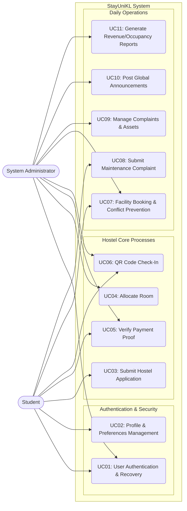

# StayUniKL — Use Case Specifications

This document outlines the detailed use cases and specifications for the StayUniKL Hostel Management System, reflecting the latest architectural updates including security hardening, QR check-ins, and analytics sync.

## 1. System Use Case Diagram

---

## 2. Detailed Use Case Specifications

<table border="1" style="width:100%; border-collapse: collapse; margin-bottom: 2rem;">
  <tr>
    <td style="width:20%;"><strong>Use Case ID</strong></td>
    <td colspan="2">UC_01</td>
  </tr>
  <tr>
    <td><strong>Use Case Name</strong></td>
    <td colspan="2">User Authentication & Recovery</td>
  </tr>
  <tr>
    <td><strong>Description</strong></td>
    <td colspan="2">Allows users to securely log into the system, register an account, or recover a forgotten password.</td>
  </tr>
  <tr>
    <td><strong>Primary Actor</strong></td>
    <td colspan="2">Student, System Administrator</td>
  </tr>
  <tr>
    <td><strong>Include use cases</strong></td>
    <td colspan="2">-</td>
  </tr>
  <tr>
    <td><strong>Pre-Condition</strong></td>
    <td colspan="2">The user is on the landing page or login portal.</td>
  </tr>
  <tr>
    <td><strong>Post-Condition</strong></td>
    <td colspan="2">User session is active. System starts tracking an inactivity timer (15 minutes).</td>
  </tr>
  <tr>
    <td rowspan="7"><strong>Main Flow</strong></td>
    <td style="width:15%;"><strong>Step</strong></td>
    <td><strong>Action</strong></td>
  </tr>
  <tr>
    <td>Pre-Condition</td>
    <td>The user is on the landing page or login portal.</td>
  </tr>
  <tr>
    <td>1.1</td>
    <td>User navigates to the login portal.</td>
  </tr>
  <tr>
    <td>1.2</td>
    <td>User enters credentials (Email & Password).</td>
  </tr>
  <tr>
    <td>1.3</td>
    <td>System validates credentials against strict complexity requirements and rate limits (5 requests/minute).</td>
  </tr>
  <tr>
    <td>1.4</td>
    <td>System generates a JWT session token and redirects to the appropriate dashboard.</td>
  </tr>
  <tr>
    <td>Post-Condition</td>
    <td>User session is active. System starts tracking an inactivity timer (15 minutes).</td>
  </tr>
  <tr>
    <td><strong>Alternate Flow</strong></td>
    <td colspan="2">If the user fails to authenticate 5 consecutive times, the system locks the account for 15 minutes to prevent brute-force attacks.</td>
  </tr>
  <tr>
    <td><strong>Robust Flow</strong></td>
    <td colspan="2">-</td>
  </tr>
</table>

<table border="1" style="width:100%; border-collapse: collapse; margin-bottom: 2rem;">
  <tr>
    <td style="width:20%;"><strong>Use Case ID</strong></td>
    <td colspan="2">UC_02</td>
  </tr>
  <tr>
    <td><strong>Use Case Name</strong></td>
    <td colspan="2">Profile & Preferences Management</td>
  </tr>
  <tr>
    <td><strong>Description</strong></td>
    <td colspan="2">Students can view official system credentials and update personal contact information, emergency contacts, and notification preferences.</td>
  </tr>
  <tr>
    <td><strong>Primary Actor</strong></td>
    <td colspan="2">Student</td>
  </tr>
  <tr>
    <td><strong>Include use cases</strong></td>
    <td colspan="2">-</td>
  </tr>
  <tr>
    <td><strong>Pre-Condition</strong></td>
    <td colspan="2">Student is authenticated and on the Dashboard.</td>
  </tr>
  <tr>
    <td><strong>Post-Condition</strong></td>
    <td colspan="2">Profile data is successfully synchronized.</td>
  </tr>
  <tr>
    <td rowspan="7"><strong>Main Flow</strong></td>
    <td style="width:15%;"><strong>Step</strong></td>
    <td><strong>Action</strong></td>
  </tr>
  <tr>
    <td>Pre-Condition</td>
    <td>Student is authenticated and on the Dashboard.</td>
  </tr>
  <tr>
    <td>1.1</td>
    <td>Student navigates to "Settings Hub".</td>
  </tr>
  <tr>
    <td>1.2</td>
    <td>Student updates address, phone number, or emergency contacts.</td>
  </tr>
  <tr>
    <td>1.3</td>
    <td>Student toggles notification preferences (e.g., Booking Alerts, Maintenance Updates).</td>
  </tr>
  <tr>
    <td>1.4</td>
    <td>System saves updates to the database.</td>
  </tr>
  <tr>
    <td>Post-Condition</td>
    <td>Profile data is successfully synchronized.</td>
  </tr>
  <tr>
    <td><strong>Alternate Flow</strong></td>
    <td colspan="2">-</td>
  </tr>
  <tr>
    <td><strong>Robust Flow</strong></td>
    <td colspan="2">-</td>
  </tr>
</table>

<table border="1" style="width:100%; border-collapse: collapse; margin-bottom: 2rem;">
  <tr>
    <td style="width:20%;"><strong>Use Case ID</strong></td>
    <td colspan="2">UC_03</td>
  </tr>
  <tr>
    <td><strong>Use Case Name</strong></td>
    <td colspan="2">Submit Hostel Application</td>
  </tr>
  <tr>
    <td><strong>Description</strong></td>
    <td colspan="2">Enables a student to apply for hostel accommodation by selecting room preferences and uploading necessary documentation.</td>
  </tr>
  <tr>
    <td><strong>Primary Actor</strong></td>
    <td colspan="2">Student</td>
  </tr>
  <tr>
    <td><strong>Include use cases</strong></td>
    <td colspan="2">-</td>
  </tr>
  <tr>
    <td><strong>Pre-Condition</strong></td>
    <td colspan="2">Student does not currently hold an active application.</td>
  </tr>
  <tr>
    <td><strong>Post-Condition</strong></td>
    <td colspan="2">Admin is notified of a new application.</td>
  </tr>
  <tr>
    <td rowspan="6"><strong>Main Flow</strong></td>
    <td style="width:15%;"><strong>Step</strong></td>
    <td><strong>Action</strong></td>
  </tr>
  <tr>
    <td>Pre-Condition</td>
    <td>Student does not currently hold an active application.</td>
  </tr>
  <tr>
    <td>1.1</td>
    <td>Student completes the application form (Program, Nationality, Room Preference).</td>
  </tr>
  <tr>
    <td>1.2</td>
    <td>Student uploads a supporting document (< 5MB limit).</td>
  </tr>
  <tr>
    <td>1.3</td>
    <td>System validates input and changes status to "Pending".</td>
  </tr>
  <tr>
    <td>Post-Condition</td>
    <td>Admin is notified of a new application.</td>
  </tr>
  <tr>
    <td><strong>Alternate Flow</strong></td>
    <td colspan="2">-</td>
  </tr>
  <tr>
    <td><strong>Robust Flow</strong></td>
    <td colspan="2">-</td>
  </tr>
</table>

<table border="1" style="width:100%; border-collapse: collapse; margin-bottom: 2rem;">
  <tr>
    <td style="width:20%;"><strong>Use Case ID</strong></td>
    <td colspan="2">UC_04</td>
  </tr>
  <tr>
    <td><strong>Use Case Name</strong></td>
    <td colspan="2">Allocate Room</td>
  </tr>
  <tr>
    <td><strong>Description</strong></td>
    <td colspan="2">Admin assigns a specific room and bed to an approved student.</td>
  </tr>
  <tr>
    <td><strong>Primary Actor</strong></td>
    <td colspan="2">System Administrator</td>
  </tr>
  <tr>
    <td><strong>Include use cases</strong></td>
    <td colspan="2">-</td>
  </tr>
  <tr>
    <td><strong>Pre-Condition</strong></td>
    <td colspan="2">Student application is "Approved" or "Payment Pending". Vacant rooms are available.</td>
  </tr>
  <tr>
    <td><strong>Post-Condition</strong></td>
    <td colspan="2">Room capacity is reduced by 1. Application status updates to "Waiting Check-in".</td>
  </tr>
  <tr>
    <td rowspan="7"><strong>Main Flow</strong></td>
    <td style="width:15%;"><strong>Step</strong></td>
    <td><strong>Action</strong></td>
  </tr>
  <tr>
    <td>Pre-Condition</td>
    <td>Student application is "Approved" or "Payment Pending". Vacant rooms are available.</td>
  </tr>
  <tr>
    <td>1.1</td>
    <td>Admin navigates to the Room Management interface.</td>
  </tr>
  <tr>
    <td>1.2</td>
    <td>Admin selects an available room and bed from the active floor plan.</td>
  </tr>
  <tr>
    <td>1.3</td>
    <td>Admin confirms allocation.</td>
  </tr>
  <tr>
    <td>1.4</td>
    <td>System generates a secure JWT-based QR Code for the student's check-in.</td>
  </tr>
  <tr>
    <td>Post-Condition</td>
    <td>Room capacity is reduced by 1. Application status updates to "Waiting Check-in".</td>
  </tr>
  <tr>
    <td><strong>Alternate Flow</strong></td>
    <td colspan="2">-</td>
  </tr>
  <tr>
    <td><strong>Robust Flow</strong></td>
    <td colspan="2">-</td>
  </tr>
</table>

<table border="1" style="width:100%; border-collapse: collapse; margin-bottom: 2rem;">
  <tr>
    <td style="width:20%;"><strong>Use Case ID</strong></td>
    <td colspan="2">UC_05</td>
  </tr>
  <tr>
    <td><strong>Use Case Name</strong></td>
    <td colspan="2">Verify Payment Proof</td>
  </tr>
  <tr>
    <td><strong>Description</strong></td>
    <td colspan="2">Student uploads a receipt for hostel fees, and Admin reviews it to clear the balance.</td>
  </tr>
  <tr>
    <td><strong>Primary Actor</strong></td>
    <td colspan="2">Student (Uploads), Admin (Verifies)</td>
  </tr>
  <tr>
    <td><strong>Include use cases</strong></td>
    <td colspan="2">-</td>
  </tr>
  <tr>
    <td><strong>Pre-Condition</strong></td>
    <td colspan="2">Application is in "Payment Pending" state.</td>
  </tr>
  <tr>
    <td><strong>Post-Condition</strong></td>
    <td colspan="2">Student balance clears to 0. A formal PDF receipt is generated.</td>
  </tr>
  <tr>
    <td rowspan="7"><strong>Main Flow</strong></td>
    <td style="width:15%;"><strong>Step</strong></td>
    <td><strong>Action</strong></td>
  </tr>
  <tr>
    <td>Pre-Condition</td>
    <td>Application is in "Payment Pending" state.</td>
  </tr>
  <tr>
    <td>1.1</td>
    <td>Student views outstanding balance in the Financials tab.</td>
  </tr>
  <tr>
    <td>1.2</td>
    <td>Student uploads an image/PDF of the payment receipt.</td>
  </tr>
  <tr>
    <td>1.3</td>
    <td>Admin reviews the document via the Admin portal.</td>
  </tr>
  <tr>
    <td>1.4</td>
    <td>Admin clicks "Approve" (or "Reject" with reason).</td>
  </tr>
  <tr>
    <td>Post-Condition</td>
    <td>Student balance clears to 0. A formal PDF receipt is generated.</td>
  </tr>
  <tr>
    <td><strong>Alternate Flow</strong></td>
    <td colspan="2">-</td>
  </tr>
  <tr>
    <td><strong>Robust Flow</strong></td>
    <td colspan="2">-</td>
  </tr>
</table>

<table border="1" style="width:100%; border-collapse: collapse; margin-bottom: 2rem;">
  <tr>
    <td style="width:20%;"><strong>Use Case ID</strong></td>
    <td colspan="2">UC_06</td>
  </tr>
  <tr>
    <td><strong>Use Case Name</strong></td>
    <td colspan="2">QR Code Check-In</td>
  </tr>
  <tr>
    <td><strong>Description</strong></td>
    <td colspan="2">Secure, automated check-in process on arrival day.</td>
  </tr>
  <tr>
    <td><strong>Primary Actor</strong></td>
    <td colspan="2">Student (Presents), Admin (Scans)</td>
  </tr>
  <tr>
    <td><strong>Include use cases</strong></td>
    <td colspan="2">-</td>
  </tr>
  <tr>
    <td><strong>Pre-Condition</strong></td>
    <td colspan="2">Student has been allocated a room and has a valid QR code on their dashboard.</td>
  </tr>
  <tr>
    <td><strong>Post-Condition</strong></td>
    <td colspan="2">Tenancy officially begins.</td>
  </tr>
  <tr>
    <td rowspan="7"><strong>Main Flow</strong></td>
    <td style="width:15%;"><strong>Step</strong></td>
    <td><strong>Action</strong></td>
  </tr>
  <tr>
    <td>Pre-Condition</td>
    <td>Student has been allocated a room and has a valid QR code on their dashboard.</td>
  </tr>
  <tr>
    <td>1.1</td>
    <td>Student opens dashboard and presents the Check-in QR code.</td>
  </tr>
  <tr>
    <td>1.2</td>
    <td>Admin uses the Mobile Scanner portal to scan the code.</td>
  </tr>
  <tr>
    <td>1.3</td>
    <td>System decrypts the JWT payload and verifies expiration.</td>
  </tr>
  <tr>
    <td>1.4</td>
    <td>System marks the student as "Checked In".</td>
  </tr>
  <tr>
    <td>Post-Condition</td>
    <td>Tenancy officially begins.</td>
  </tr>
  <tr>
    <td><strong>Alternate Flow</strong></td>
    <td colspan="2">-</td>
  </tr>
  <tr>
    <td><strong>Robust Flow</strong></td>
    <td colspan="2">-</td>
  </tr>
</table>

<table border="1" style="width:100%; border-collapse: collapse; margin-bottom: 2rem;">
  <tr>
    <td style="width:20%;"><strong>Use Case ID</strong></td>
    <td colspan="2">UC_07</td>
  </tr>
  <tr>
    <td><strong>Use Case Name</strong></td>
    <td colspan="2">Facility Booking & Conflict Prevention</td>
  </tr>
  <tr>
    <td><strong>Description</strong></td>
    <td colspan="2">Students can reserve time slots for facilities (e.g., Badminton Court, Gym) while the system prevents double-booking. Admin can block slots.</td>
  </tr>
  <tr>
    <td><strong>Primary Actor</strong></td>
    <td colspan="2">Student, Admin (Blocking)</td>
  </tr>
  <tr>
    <td><strong>Include use cases</strong></td>
    <td colspan="2">-</td>
  </tr>
  <tr>
    <td><strong>Pre-Condition</strong></td>
    <td colspan="2">Facility is active.</td>
  </tr>
  <tr>
    <td><strong>Post-Condition</strong></td>
    <td colspan="2">Slot is permanently booked.</td>
  </tr>
  <tr>
    <td rowspan="7"><strong>Main Flow</strong></td>
    <td style="width:15%;"><strong>Step</strong></td>
    <td><strong>Action</strong></td>
  </tr>
  <tr>
    <td>Pre-Condition</td>
    <td>Facility is active.</td>
  </tr>
  <tr>
    <td>1.1</td>
    <td>Student views the calendar grid.</td>
  </tr>
  <tr>
    <td>1.2</td>
    <td>Student selects an available 1-hour time slot.</td>
  </tr>
  <tr>
    <td>1.3</td>
    <td>System locks the slot transactionally to prevent concurrency conflicts.</td>
  </tr>
  <tr>
    <td>1.4</td>
    <td>System confirms booking.</td>
  </tr>
  <tr>
    <td>Post-Condition</td>
    <td>Slot is permanently booked.</td>
  </tr>
  <tr>
    <td><strong>Alternate Flow</strong></td>
    <td colspan="2">Admin selects a slot and clicks "Set as Maintenance". The slot becomes greyed out and unavailable for all students.</td>
  </tr>
  <tr>
    <td><strong>Robust Flow</strong></td>
    <td colspan="2">-</td>
  </tr>
</table>

<table border="1" style="width:100%; border-collapse: collapse; margin-bottom: 2rem;">
  <tr>
    <td style="width:20%;"><strong>Use Case ID</strong></td>
    <td colspan="2">UC_08</td>
  </tr>
  <tr>
    <td><strong>Use Case Name</strong></td>
    <td colspan="2">Submit Maintenance Complaint</td>
  </tr>
  <tr>
    <td><strong>Description</strong></td>
    <td colspan="2">Students can log issues (plumbing, electrical, furniture) occurring in their assigned rooms.</td>
  </tr>
  <tr>
    <td><strong>Primary Actor</strong></td>
    <td colspan="2">Student</td>
  </tr>
  <tr>
    <td><strong>Include use cases</strong></td>
    <td colspan="2">-</td>
  </tr>
  <tr>
    <td><strong>Pre-Condition</strong></td>
    <td colspan="2">Student is checked into a room.</td>
  </tr>
  <tr>
    <td><strong>Post-Condition</strong></td>
    <td colspan="2">Complaint is logged.</td>
  </tr>
  <tr>
    <td rowspan="6"><strong>Main Flow</strong></td>
    <td style="width:15%;"><strong>Step</strong></td>
    <td><strong>Action</strong></td>
  </tr>
  <tr>
    <td>Pre-Condition</td>
    <td>Student is checked into a room.</td>
  </tr>
  <tr>
    <td>1.1</td>
    <td>Student navigates to Complaints.</td>
  </tr>
  <tr>
    <td>1.2</td>
    <td>Student describes the issue, selects category, and optionally uploads a photo.</td>
  </tr>
  <tr>
    <td>1.3</td>
    <td>System automatically ties the complaint to the student's assigned room.</td>
  </tr>
  <tr>
    <td>Post-Condition</td>
    <td>Complaint is logged.</td>
  </tr>
  <tr>
    <td><strong>Alternate Flow</strong></td>
    <td colspan="2">-</td>
  </tr>
  <tr>
    <td><strong>Robust Flow</strong></td>
    <td colspan="2">-</td>
  </tr>
</table>

<table border="1" style="width:100%; border-collapse: collapse; margin-bottom: 2rem;">
  <tr>
    <td style="width:20%;"><strong>Use Case ID</strong></td>
    <td colspan="2">UC_09</td>
  </tr>
  <tr>
    <td><strong>Use Case Name</strong></td>
    <td colspan="2">Manage Complaints & Assets</td>
  </tr>
  <tr>
    <td><strong>Description</strong></td>
    <td colspan="2">Admin resolves complaints, which automatically syncs with Room Asset Conditions.</td>
  </tr>
  <tr>
    <td><strong>Primary Actor</strong></td>
    <td colspan="2">Admin</td>
  </tr>
  <tr>
    <td><strong>Include use cases</strong></td>
    <td colspan="2">-</td>
  </tr>
  <tr>
    <td><strong>Pre-Condition</strong></td>
    <td colspan="2">Active complaints exist.</td>
  </tr>
  <tr>
    <td><strong>Post-Condition</strong></td>
    <td colspan="2">Asset analytics accurately reflect current hostel integrity.</td>
  </tr>
  <tr>
    <td rowspan="7"><strong>Main Flow</strong></td>
    <td style="width:15%;"><strong>Step</strong></td>
    <td><strong>Action</strong></td>
  </tr>
  <tr>
    <td>Pre-Condition</td>
    <td>Active complaints exist.</td>
  </tr>
  <tr>
    <td>1.1</td>
    <td>Admin reviews a new complaint.</td>
  </tr>
  <tr>
    <td>1.2</td>
    <td>The system automatically flags the related Room Asset Condition to "Needs Repair" based on database collation sync.</td>
  </tr>
  <tr>
    <td>1.3</td>
    <td>Admin marks complaint as "Resolved".</td>
  </tr>
  <tr>
    <td>1.4</td>
    <td>Room asset status returns to "Good".</td>
  </tr>
  <tr>
    <td>Post-Condition</td>
    <td>Asset analytics accurately reflect current hostel integrity.</td>
  </tr>
  <tr>
    <td><strong>Alternate Flow</strong></td>
    <td colspan="2">-</td>
  </tr>
  <tr>
    <td><strong>Robust Flow</strong></td>
    <td colspan="2">-</td>
  </tr>
</table>

<table border="1" style="width:100%; border-collapse: collapse; margin-bottom: 2rem;">
  <tr>
    <td style="width:20%;"><strong>Use Case ID</strong></td>
    <td colspan="2">UC_10</td>
  </tr>
  <tr>
    <td><strong>Use Case Name</strong></td>
    <td colspan="2">Post Global Announcements</td>
  </tr>
  <tr>
    <td><strong>Description</strong></td>
    <td colspan="2">Admin broadcasts critical information to all students.</td>
  </tr>
  <tr>
    <td><strong>Primary Actor</strong></td>
    <td colspan="2">Admin</td>
  </tr>
  <tr>
    <td><strong>Include use cases</strong></td>
    <td colspan="2">-</td>
  </tr>
  <tr>
    <td><strong>Pre-Condition</strong></td>
    <td colspan="2">None.</td>
  </tr>
  <tr>
    <td><strong>Post-Condition</strong></td>
    <td colspan="2">Students see the announcement on their dashboard hero banner.</td>
  </tr>
  <tr>
    <td rowspan="5"><strong>Main Flow</strong></td>
    <td style="width:15%;"><strong>Step</strong></td>
    <td><strong>Action</strong></td>
  </tr>
  <tr>
    <td>Pre-Condition</td>
    <td>None.</td>
  </tr>
  <tr>
    <td>1.1</td>
    <td>Admin writes a title, content, and sets a priority level (e.g., High, Normal).</td>
  </tr>
  <tr>
    <td>1.2</td>
    <td>System pushes the announcement to the student feed.</td>
  </tr>
  <tr>
    <td>Post-Condition</td>
    <td>Students see the announcement on their dashboard hero banner.</td>
  </tr>
  <tr>
    <td><strong>Alternate Flow</strong></td>
    <td colspan="2">-</td>
  </tr>
  <tr>
    <td><strong>Robust Flow</strong></td>
    <td colspan="2">-</td>
  </tr>
</table>

<table border="1" style="width:100%; border-collapse: collapse; margin-bottom: 2rem;">
  <tr>
    <td style="width:20%;"><strong>Use Case ID</strong></td>
    <td colspan="2">UC_11</td>
  </tr>
  <tr>
    <td><strong>Use Case Name</strong></td>
    <td colspan="2">Generate Revenue/Occupancy Reports</td>
  </tr>
  <tr>
    <td><strong>Description</strong></td>
    <td colspan="2">Admin exports aggregated system analytics for management review.</td>
  </tr>
  <tr>
    <td><strong>Primary Actor</strong></td>
    <td colspan="2">Admin</td>
  </tr>
  <tr>
    <td><strong>Include use cases</strong></td>
    <td colspan="2">-</td>
  </tr>
  <tr>
    <td><strong>Pre-Condition</strong></td>
    <td colspan="2">System has historical data.</td>
  </tr>
  <tr>
    <td><strong>Post-Condition</strong></td>
    <td colspan="2">File downloads successfully to the Admin's local machine.</td>
  </tr>
  <tr>
    <td rowspan="6"><strong>Main Flow</strong></td>
    <td style="width:15%;"><strong>Step</strong></td>
    <td><strong>Action</strong></td>
  </tr>
  <tr>
    <td>Pre-Condition</td>
    <td>System has historical data.</td>
  </tr>
  <tr>
    <td>1.1</td>
    <td>Admin selects date ranges on the Analytics dashboard.</td>
  </tr>
  <tr>
    <td>1.2</td>
    <td>Admin clicks "Export PDF/CSV".</td>
  </tr>
  <tr>
    <td>1.3</td>
    <td>System compiles total revenue, current occupancy rates, and active maintenance counts into a structured file.</td>
  </tr>
  <tr>
    <td>Post-Condition</td>
    <td>File downloads successfully to the Admin's local machine.</td>
  </tr>
  <tr>
    <td><strong>Alternate Flow</strong></td>
    <td colspan="2">-</td>
  </tr>
  <tr>
    <td><strong>Robust Flow</strong></td>
    <td colspan="2">-</td>
  </tr>
</table>

